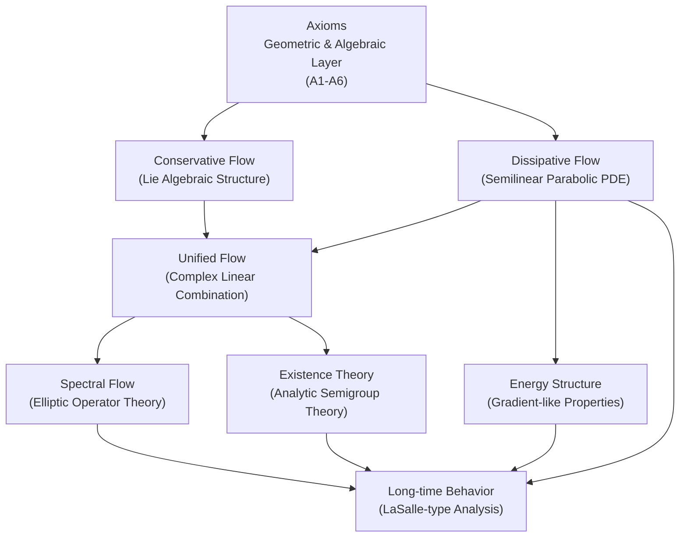
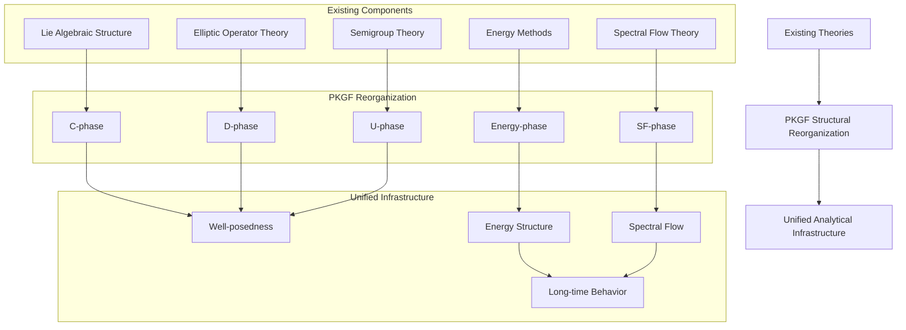
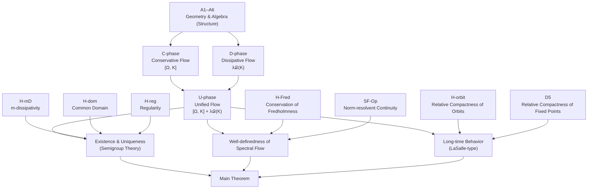
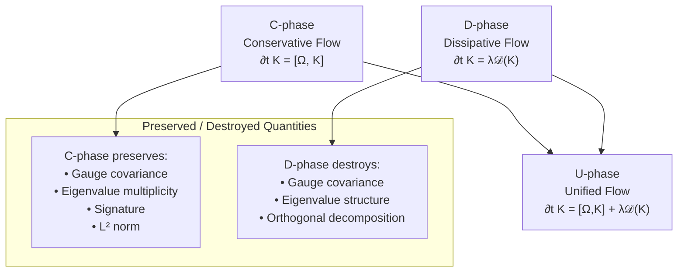
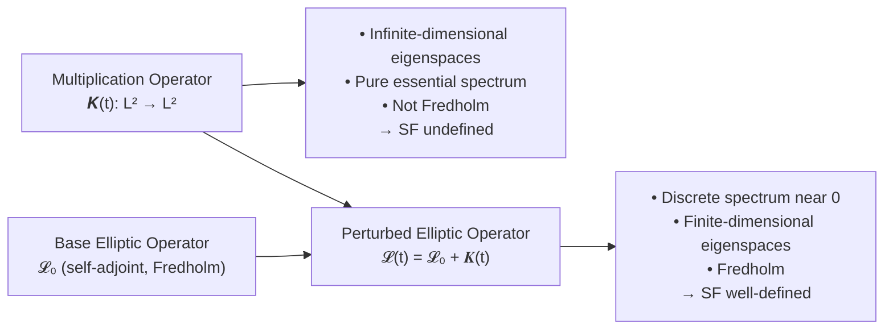
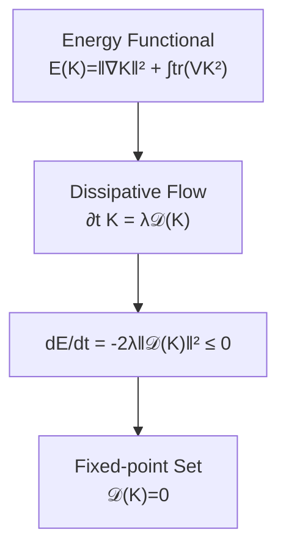
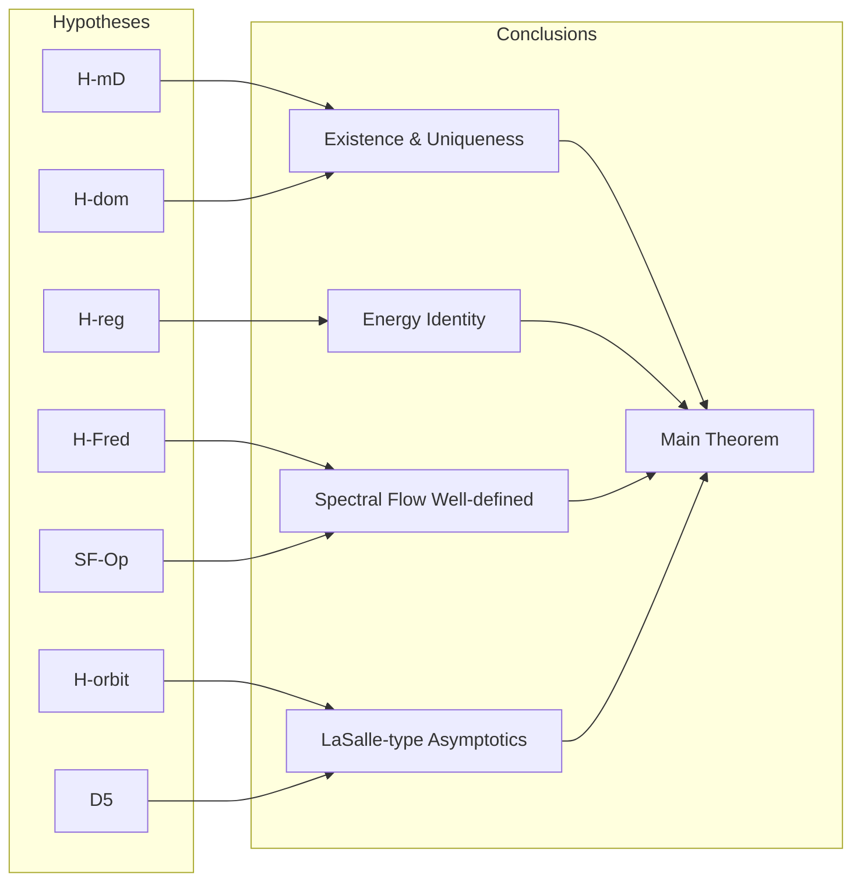

# Parallel Key Geometric Flow (PKGF):
A Mathematical Infrastructure for Unified Conservative–Dissipative Systems

**Author: Fumio Miyata**  
**Date: April 2026**  
**DOI:** [https://doi.org/10.5281/zenodo.19876955](https://doi.org/10.5281/zenodo.19876955)  
**Repository:** [https://github.com/aikenkyu001/PoI_theory](https://github.com/aikenkyu001/PoI_theory)  

---

# **0. Abstract**

This paper provides a rigorous formulation of Parallel Key Geometric Flow (PKGF), a framework for unifying conservative and dissipative flows arising from the temporal evolution of operators on finite-dimensional vector bundles. 

Under this framework, we treat:
- **Conservative flows** of commutator type (generated by skew-adjoint operators), and
- **Dissipative flows** based on elliptic operators (generated by m-dissipative operators)

as evolution equations within a common Hilbert space, defining the **Unified Flow** as their complex linear combination. We emphasize that in the present formulation, the evolution equations are strictly linear with respect to the state variable $K$, thereby remaining within the scope of classical linear semigroup theory without necessitating non-linear PDE methods (though non-linear extensions are possible and discussed as future work). This restriction ensures analytical transparency and structural integrity.

Furthermore, we provide:
- A rigorous derivation of the **energy structure** (gradient-like properties).
- A clear distinction between **strong solutions** and **mild solutions**.
- Formal criteria for the well-definedness of **spectral flow**, separating the requirements of the Fredholm property from norm-resolvent continuity.
- Explicit conditions for the validity of **LaSalle-type arguments** in infinite-dimensional settings.

The primary objective of PKGF is not to introduce a novel class of physical flows, but rather to establish a rigorous infrastructure for the integrated application of existing parabolic PDE theory, semigroup theory, and spectral flow theory. This analytical foundation provides a robust platform for the future development of unified field theories and non-equilibrium statistical models.

**Figure 1. Structural Hierarchy of PKGF**

- **Axioms**: Define the geometric and algebraic constraints (Input: Manifold/Bundle setup, Output: Structural constraints).
- **Conservative / Dissipative Flow (C/D Layers)**: Decouple the reversible and irreversible components (Input: Potential/Operator, Output: Evolution equations).
- **Unified Flow (U Layer)**: Integrate C and D via complexification (Input: Complexification, Output: Linear unified flow).
- **Spectral Flow (SF Layer)**: Topological invariants derived from elliptic realizations (Input: Elliptic realization, Output: Integer invariants).
- **Existence Theory**: Ensures well-posedness (Input: Semigroup theory, Output: Strong/Mild solutions).
- **Energy / Long-time Behavior**: Analysis of asymptotic stability (Input: Lyapunov structure, Output: Convergence to fixed points).

---

# **Table of Contents**

0. Abstract  
1. Mathematical Framework  
 1.1 Manifolds and Vector Bundles  
 1.2 Endomorphism Bundles and Section Spaces  
 1.3 Hilbert–Schmidt and Global $L^2$ Inner Products  
 1.4 Notation  
 1.5 Physical Motivation  
2. Axiomatic Framework  
3. Conservative Flow (C-phase)  
4. Dissipative Flow (D-phase)  
5. Unified Flow (U-phase)  
6. Spectral Flow (SF-phase)  
7. Existence and Well-posedness (Semigroup Theory)  
8. Model Classes (Ensuring Non-vacuousness)  
9. Long-time Behavior of Dissipative Components  
10. Energy Structure (Gradient-like Analysis)  
11. Main Theorem  
12. Conclusion  
13. Future Directions  

---

# **1. Mathematical Framework**

PKGF is constructed upon established mathematical frameworks, including:
- Vector bundles over Riemannian manifolds.
- Sobolev space theory.
- Elliptic operator theory.
- linear (a special case of semilinear) parabolic PDEs.
- Gauge-theoretic structures.

The goal of PKGF is not to extend these theories, but to **reorganize them into a single, unified flow architecture**.

---

## **1.1 Manifolds and Vector Bundles**

- $M$: A finite-dimensional, compact Riemannian manifold.
- $E \to M$: A real or complex vector bundle of rank $n < \infty$.

This setup provides the minimum necessary prerequisites to apply Sobolev embeddings, elliptic operator theory, and gauge theory.

---

## **1.2 Endomorphism Bundles and Section Spaces**

Endomorphism Bundle:
\[
\mathrm{End}(E) = E \otimes E^*
\]

The space of sections:
\[
\Gamma(\mathrm{End}(E))
\]
is an infinite-dimensional linear space. The temporal evolution of operators defined on this space is the primary object of study in PKGF.

---

## **1.3 Hilbert–Schmidt and Global $L^2$ Inner Products**

Local Hilbert–Schmidt inner product:
\[
\langle A(x), B(x)\rangle_{HS} = \mathrm{tr}(A(x)^* B(x)).
\]

Global $L^2$ inner product:
\[
\langle\!\langle A, B\rangle\!\rangle_{L^2} = \int_M \langle A(x), B(x)\rangle_{HS}\,\mathrm{dvol}(x).
\]

These define the common Hilbert space structure required to handle conservative, dissipative, and unified flows simultaneously.

---

## **1.4 Notation**

The primary notation used in this paper is summarized as follows:

- $K \in \Gamma(\mathrm{End}(E))$: The fundamental section (Parallel Key).[^1]

...

[^1]: Mathematically, the "Key" refers to a **distinguished section** of the endomorphism bundle, and the "Parallel Key" refers to this **distinguished evolving endomorphism** that serves as the state variable in the integrated flow.
- $K_{\mathrm{core}}$: The conservative component.
- $K_{\mathrm{fluct}}$: The dissipative (fluctuation) component.
- $\widetilde{K} = K_{\mathrm{core}} + i K_{\mathrm{fluct}}$: The complexified unified operator.
- $\mathcal{D}$: The dissipative operator.
- $\Omega$: The self-adjoint potential generating the conservative flow.
- $\mathcal{L}(t) = \mathcal{L}_0 + \widetilde{K}(t)$: A family of elliptic operators used to define spectral flow.

---

## **1.5 Physical Motivation**

In many modern physical systems—particularly non-equilibrium and open systems—conservative (reversible) dynamics, dissipative (irreversible) processes, and topological invariants often manifest simultaneously.

However, integrating these elements into a single, consistent mathematical framework is non-trivial. Specifically:
- **Conservative structures** (Lie algebraic)
- **Dissipative structures** (Parabolic PDEs)
- **Spectral flow** (Elliptic operator theory)

each belong to distinct theoretical backgrounds and have traditionally been treated in isolation. PKGF aims to logically decouple and then reintegrate these structures within the bounds of existing theory, providing a foundation to safely handle these elements as they appear in physical models.

---

# **2. Axiomatic Framework**
― Structural Prerequisites for Integrated Theory ―

The axioms of PKGF are not intended to introduce new mathematical objects but are designed as the **minimal set of prerequisites for reorganizing existing geometric and algebraic structures into a unified flow framework**.

In this section, we present the **Structural Layer**, which defines the geometric and algebraic configuration independently of analytical hypotheses. This establishes the logical basis for handling conservative, dissipative, unified, and spectral flows without contradiction.

### **2.1 Structural Dependency (DAG) — Visualization of the Three-Layer Philosophy**

We visualize the "Structure → Analysis → Conclusion" philosophy of PKGF below.

---

## **A1 (Manifold)**

\[
M \text{ is a finite-dimensional, compact Riemannian manifold.}
\]

This is the minimal geometric prerequisite for applying standard analytical tools such as Sobolev embeddings and elliptic theory.

---

## **A2 (Orthogonal Decomposition)**

If necessary, the vector bundle $E$ admits an orthogonal direct sum decomposition:
\[
E = \bigoplus_{\alpha=1}^N E_\alpha
\]
This decomposition is a standard framework for handling **subspace invariance** in gauge theory and conservative flows.

---

## **A3 (Initial Parallel Key Properties)**

At the initial time $t=0$, the section
\[
K(0) \in \Gamma(\mathrm{End}(E))
\]
is self-adjoint Fredholm and possesses a spectral gap at 0.

This condition is a canonical requirement for **unambiguously defining the zero-crossing of eigenvalues** in spectral flow, aligning with classical assumptions in elliptic operator theory (see [Phillips 1996], [Waterstraat 2016]).

**Note:** While A3 is a hypothesis at the initial time only, the maintenance of Fredholmness during evolution is addressed via the analytical hypothesis **H-Fred (Conservation of Fredholmness)**. Together, they ensure that the initial state is a valid starting point for well-defined spectral flow across all $t$.

---

## **A3' (Complexification for U-phase)**

The conservative and dissipative components are integrated via complexification:
\[
\widetilde{K} = K_{\mathrm{core}} + i K_{\mathrm{fluct}}
\]
Complexification is a **canonical operation to handle conservative (Lie algebraic) and dissipative (PDE-based) flows within a single complex Hilbert space** and does not introduce new mathematical objects. This complexification is analogous to the standard identification of a pair of real operators with a single complex operator.

---

## **A4 (Gauge Group)**

Let 
\[
\mathcal{G} = \{ g \in \Gamma(\mathrm{Aut}(E)) \mid g^* g = I \}
\]
be the unitary (or orthogonal) gauge group. This provides the canonical framework for handling the adjoint action $K \mapsto g^{-1} K g$.

---

## **A5 (Connection)**

\[
\nabla \text{ is a connection compatible with the bundle metric.}
\]
This ensures a **common differential structure** for both conservative and dissipative components.

---

## **A6 (Potential)**

\[
\Omega \in \Gamma(\mathrm{End}(E)) \quad \text{is self-adjoint.}
\]
This is the canonical requirement to utilize existing Lie algebraic structures as generators of the conservative flow.

---

## **Role of the Axiomatic Layer**

Axioms A1–A6 are independent of analytical hypotheses (H-mD, H-reg, etc.) and form a **Structural Layer** that defines the geometric and algebraic prerequisites. This separation ensures that:
- Conservative flows (Lie algebraic)
- Dissipative flows (Elliptic + PDE)
- Unified flows (Complex linear combination)
- Spectral flow (Fredholm theory)

can be integrated into a logically consistent framework without mutual interference.

---

# **3. Conservative Flow (C-phase)**
― Reorganization of Lie Algebraic Structures ―

The Conservative Flow (C-phase) handles the temporal evolution based on the **Lie algebraic adjoint action** on bundle endomorphisms. This structure has been utilized in quantum mechanics, gauge theory, and matrix mechanics for decades; PKGF positions it as the **conservative component** within its unified framework.

---

## **3.1 C1 (Conservative Equation)**

The conservative flow is defined by the adjoint action of a self-adjoint potential $\Omega$:
\[
\partial_t K = [\Omega, K] = \Omega K - K \Omega
\]
This aligns with the conservative structures observed in the geometry of determinant bundles [Bismut & Freed 1986] and the dynamics of gauge-theoretic flows [Feehan 2021].

This is the differential form of the unitary (or orthogonal) action:
\[
K(t) = e^{t\Omega} K(0) e^{-t\Omega}
\]
which is the canonical representation of Lie group adjoint actions. Thus, the C-phase adopts established Lie algebraic structures as its evolutionary engine.

---

## **3.2 C2 (Gauge Covariance)**

The conservative flow is invariant under gauge transformations:
\[
K \mapsto g^{-1} K g, \qquad g \in \mathcal{G}
\]
Indeed,
\[
\partial_t (g^{-1} K g) = g^{-1} [\Omega, K] g = [g^{-1}\Omega g,\, g^{-1} K g]
\]
maintaining the form of the adjoint action. This is a classical result demonstrating that the conservative flow is **fully gauge covariant**.

---

## **3.3 C3 (Conservation of Orthogonal Decomposition)**

Given an orthogonal decomposition $E = \bigoplus_{\alpha=1}^N E_\alpha$, if the projection $\Pi_\alpha$ satisfies $[K, \Pi_\alpha] = 0$, then the conservative flow preserves the subspaces:
\[
K(t)(E_\alpha) \subset E_\alpha
\]
This utilizes the textbook linear algebraic result that adjoint actions preserve invariant subspaces.

---

## **3.4 Preserved and Destroyed Quantities**
― Delineating the Roles of C-phase and D-phase ―

A key feature of PKGF is the explicit separation of conservative and dissipative components, delineating which quantities each component preserves or alters.

| Quantity | C-phase (Conservative) | D-phase (Dissipative) |
| :--- | :--- | :--- |
| **Eigenvalue Multiplicity** | Preserved | Generally Destroyed |
| **Signature** | Preserved | Generally Destroyed |
| **Orthogonal Decomposition** | Preserved | Generally Destroyed |
| **$L^2$-norm** | Preserved | Decays |
| **Energy $E$** | Preserved | Monotonically Decreases |

### **Quantities Preserved by C-phase**
The flow $\partial_t K = [\Omega, K]$ preserves:
- Eigenvalue multiplicity.
- Signature.
- Orthogonal decompositions.
- $L^2$-norm.
- Energy $E(K)$.

These are all canonical properties of adjoint actions.

---

### **Quantities Altered by D-phase**
Conversely, the dissipative flow $\partial_t K = \lambda \mathcal{D}(K)$ generally does not preserve:
- Gauge covariance.
- Eigenvalue structure.
- Orthogonal decompositions.

This is a direct consequence of the **dissipativity** inherent in parabolic PDEs.

---

## **3.5 Role of the C-phase**

The conservative flow handles:
- Geometric symmetry.
- Lie algebraic structure.
- Gauge covariance.
- Preservation of eigenvalue structure.

It provides the **conservative baseline** against which dissipative and unified flows are measured. PKGF's contribution lies in repositioning this classical structure as an integral part of a unified flow.

---

### **Proposition (Abstract Structure of Conservative Flows)**
The C-phase possesses the same structure as the generation of unitary groups by skew-adjoint operators on Hilbert spaces. Thus, this flow is essentially an abstraction of Hamiltonian-type systems.

---

# **4. Dissipative Flow (D-phase)**
― Integration of Canonical Parabolic PDE Theory ―

The Dissipative Flow (D-phase) utilizes the canonical theory of **semilinear (specifically linear) parabolic partial differential equations**. PKGF does not invent new operators but reorganizes established elliptic operator theory, Sobolev space theory, and energy methods into a unified architecture.

---

## **4.1 Definition of the Dissipative Operator**

The dissipative operator $\mathcal{D}$ is defined as:
\[
\mathcal{D}(K) = -\nabla^*\nabla K - (V K + K V), \qquad V(x) \ge c I > 0
\]
All elements are established:
- $\nabla^*\nabla$: Bochner Laplacian (strongly elliptic).
- $V$: A positive definite zeroth-order bundle map.
- $VK + KV$: Canonical zeroth-order terms.

PKGF adopts the structure of these **classical elliptic operators** without modification.

---

## **4.2 D1 (Negative Definiteness in Global $L^2$)**

The dissipative operator satisfies the following with respect to the global $L^2$ inner product:
\[
\langle\!\langle \mathcal{D}(K), K \rangle\!\rangle_{L^2} \le 0
\]
This is the **canonical dissipativity** obtained when combining strongly elliptic operators with positive definite potentials.

---

## **4.3 D2 (The Dissipative Equation: Canonical Parabolic PDE)**

The dissipative flow is given by:
\[
\partial_t K = \lambda \mathcal{D}(K)
\]
This is a specific instance of the canonical semilinear parabolic PDE form:
\[
\partial_t u = A u + F(u)
\]
PKGF adopts this form to facilitate future non-linear extensions, though the present framework remains fully linear as $F$ acts as a linear operator (or zero).

---

## **4.4 Eigenvalue Behavior in Infinite Dimensions**

While dissipative terms can cause monotonic eigenvalue decay in 0-dimensional models (matrix ODEs), **eigenvalue monotonicity generally fails in infinite-dimensional PDEs** due to eigenvalue mixing. This is a standard fact in PDE theory, not a new discovery of PKGF.

---

## **4.5 D5 (Relative Compactness of the Fixed-point Set)**

We hypothesize that the set of fixed points 
\[
\mathcal{F} = \{ K \mid \mathcal{D}(K)=0 \}
\]
is relatively compact. This is a **canonical auxiliary hypothesis** required to establish LaSalle-type long-time behavior in infinite dimensions and is not unique to PKGF.

---

## **4.6 Role of the D-phase**

The dissipative flow handles:
- Energy decay.
- Regularity enhancement.
- Analysis of long-time behavior.
- Convergence to fixed-point sets.

While the C-phase preserves symmetry, the D-phase embodies the PDE-based property of **decaying energy while breaking symmetry**. PKGF integrates this classical dissipative structure into its unified framework.

---

### **Proposition (Relationship to Semigroup Theory)**
The operator $\mathcal{D}$ is assumed to be m-dissipative, and thus generates a strongly continuous contraction semigroup on $L^2$. This is perfectly consistent with the framework of canonical linear parabolic equations.

---

# **5. Unified Flow (U-phase)**
― Integration via Complex Linear Combination of Conservative and Dissipative Flows ―

The Unified Flow (U-phase) is a framework that **integrates conservative structures (Lie algebraic) and dissipative structures (Parabolic PDE)** via a complex linear combination. PKGF reorganizes these existing structures to handle them as a single, consistent flow through the process of complexification.

---

## **5.1 U1 (Complexification via Existing Hilbert Space Structures)**

We complexify the conservative component $K_{\mathrm{core}}$ and the dissipative component $K_{\mathrm{fluct}}$ as:
\[
\widetilde{K} = K_{\mathrm{core}} + i K_{\mathrm{fluct}}
\]
This complexification and its relationship to analytical metrics find deep parallels in the analysis of Quillen metrics provided by [Bismut & Lebeau 1991].

Complexification is natural because:
- Conservative flows possess **skew-adjoint** structures.
- Dissipative flows possess **self-adjoint** structures.
- Complexification is the most **canonical** way to treat both within a single Hilbert space.

This is a **classical operation** in Hilbert space theory; PKGF does not introduce new mathematical objects.

---

## **5.2 U2 (Initial Orthogonality)**

To prevent the initial mixing of complexified components, we assume at the initial time:
\[
\langle\!\langle K_{\mathrm{core}}(0), K_{\mathrm{fluct}}(0)\rangle\!\rangle_{L^2} = 0
\]
**Note:** Initial orthogonality is a **technical assumption** and serves as a **sufficient condition** for the Main Theorem. It is **not a necessary condition**, but it provides a canonical setting to preserve physical/geometric consistency and independently track conservative and dissipative components.

---

## **5.3 U3 (The Unified Equation)**

The Unified Flow is defined as:
\[
\partial_t \widetilde{K} = [\Omega, \widetilde{K}] + \lambda \mathcal{D}(\widetilde{K})
\]

### **Lemma (Linearity of U-phase)**
The unified flow equation $\partial_t \widetilde{K} = [\Omega, \widetilde{K}] + \lambda \mathcal{D}(\widetilde{K})$ is strictly linear with respect to the variable $\widetilde{K}$.

**Proof:**
1. The conservative term $[\Omega, \widetilde{K}] = \Omega \widetilde{K} - \widetilde{K} \Omega$ is a linear operator on $\widetilde{K}$.
2. The dissipative term $\mathcal{D}(\widetilde{K})$ is linear by definition.
3. Their sum is therefore linear. $\square$

**Note:** This linearity is a crucial property ensuring the analytical transparency of PKGF. Complexification is an algebraic method for integration and does not introduce non-linearity. Consequently, well-posedness is fully resolved within classical linear semigroup theory, without requiring non-linear extensions.

The right-hand side is simply the **complex linear sum** of:
- Conservative flow: $[\Omega, \widetilde{K}]$
- Dissipative flow: $\lambda \mathcal{D}(\widetilde{K})$

Thus, the U-phase is a flow **naturally defined as a linear combination of existing structures**. This decomposition is not merely formal; it is a structure that necessarily emerges in physical models requiring the coexistence of conservation and dissipation on a single state variable.

---

## **5.4 Persistence of Analytical Hypotheses after Complexification**

Complexification preserves all relevant analytical properties:
- $\nabla^*\nabla$ remains strongly elliptic as a complex linear operator.
- $V K + K V$ remains a closed operator in complex Hilbert space.
- m-dissipativity (H-mD) is invariant under complexification.
- The domain (H-dom) remains unchanged.
- Regularity (H-reg) is maintained through the complexification of Sobolev spaces.

Thus, complexification is guaranteed to be a **canonical operation that does not violate existing analytical theory**.

---

## **5.5 Role of the U-phase**

The Unified Flow forms the **integration layer** that treats:
- Conservative structures (Symmetry/Adjoint action)
- Dissipative structures (Energy decay/Regularity enhancement)

as a single evolution. PKGF's contribution is the explicit demonstration that these can be integrated consistently within a complex Hilbert space.

---

### **Proposition (Definition and Notation of Unified Operators)**
Given a conservative component $K_{\mathrm{core}}$ and a dissipative component $K_{\mathrm{fluct}}$, we define the unified operator as:
\[
\widetilde{K} = K_{\mathrm{core}} + i K_{\mathrm{fluct}}
\]
Henceforth, unless otherwise specified, $\widetilde{K}$ refers to this complexified unified operator.

---

### **5.6 Physical Interpretation (Reversible/Irreversible Decomposition)**

The Unified Flow can be interpreted as a decomposition into:
- **Conservative component**: Reversible dynamics.
- **Dissipative component**: Irreversible processes.

This structure formally corresponds to the **reversible-irreversible decomposition** in non-equilibrium statistical mechanics. Thus, PKGF's unified flow is not merely a linear sum but a mathematical reproduction of the fundamental temporal evolution structures found in physical systems.

---

# **6. Spectral Flow (SF-phase)**
― Integrating Canonical Elliptic Theory into the PKGF Context ―

Spectral flow (SF) is a **classical concept in elliptic operator theory** since Atiyah–Patodi–Singer and is not a new introduction by PKGF. The role of PKGF is to provide the **correct positioning to handle spectral flow consistently** within the context of conservative, dissipative, and unified flows.

Crucially, PKGF clarifies that:
- SF cannot be defined directly on the multiplication operator $\widetilde{K}(t)$.
- It must be "lifted" to an elliptic operator $\mathcal{L}(t) = \mathcal{L}_0 + \widetilde{K}(t)$.
- Conservation of Fredholmness (H-Fred) and norm-resolvent continuity (SF-Op) are independent requirements.

---

## **6.1 Introduction of Fredholm Operators**
― Why realized on Elliptic Operators rather than $\widetilde{K}(t)$ alone ―

The fundamental variable $\widetilde{K}(t)$ is a **pointwise multiplication operator** on $L^2(M,E)$. Standard operator theory dictates that such operators:
- Have infinite-dimensional eigenspaces.
- Consist entirely of essential spectrum.
- Are **not Fredholm**.

Consequently, **spectral flow cannot be defined directly on $\widetilde{K}(t)$**. Following classical methods, PKGF adds $\widetilde{K}(t)$ as a potential to an elliptic operator. This clarifies that spectral flow is not an intrinsic property of $\widetilde{K}(t)$ itself, but a property of its **realization as a perturbation of an elliptic operator**.

---

### **Definition (Integrated Elliptic Operator: Utilizing Existing Theory)**

Given a fixed self-adjoint elliptic operator $\mathcal{L}_0$, we define:
\[
\mathcal{L}(t) = \mathcal{L}_0 + \widetilde{K}(t)
\]
Where:
- $\mathcal{L}_0$: A self-adjoint elliptic operator (e.g., Dirac-type or Laplace-type).
- $\widetilde{K}(t)$: A self-adjoint zeroth-order bundle map.

This construction is a canonical technique in elliptic theory. Under this setup, $\mathcal{L}(t)$ remains a **self-adjoint Fredholm operator** for all $t$.

---

## **6.2 Definition of Spectral Flow (Canonical Definition)**

For a family of self-adjoint Fredholm operators $\{\mathcal{L}(t)\}_{t \in [0,1]}$, the spectral flow is defined as:
\[
\mathrm{SF}(\mathcal{L}(t)) \in \mathbb{Z}
\]
which counts the signed net number of eigenvalues crossing zero (see [Bär & Ziemke 2025], [Van den Dungen & Ronge 2021] for rigorous formulations). PKGF adopts this established definition directly.

---

## **6.3 Relationship to Signature Jumps (Realigning Classical Results)**

Since the eigenspaces of $\mathcal{L}(t)$ are finite-dimensional, the signature $\sigma(t) = n_+(t) - n_-(t)$ takes finite values. A classical result states:
\[
\mathrm{SF}(\mathcal{L}(t)) = \sum_{t_c} \frac{1}{2}\bigl(\sigma(t_c^+) - \sigma(t_c^-)\bigr)
\]
PKGF integrates this existing relationship into the context of conservative and dissipative flows.

---

## **6.4 Necessity of Lifting to Elliptic Operators**

The multiplication operator $\widetilde{K}(t)$ fails to meet the minimum requirements for defining spectral flow because of its infinite-dimensional eigenspaces and pure essential spectrum. Thus, PKGF adopts the classical approach of **lifting $\widetilde{K}(t)$ as a potential onto an elliptic operator (elliptic realization)**.

---

## **6.5 Independence of H-Fred and SF-Op**
― Preventing Misapplication of Existing Theory ―

To handle spectral flow, two conditions must be distinguished:
- **H-Fred**: Maintenance of the Fredholm property over time.
- **SF-Op**: Common domain + norm-resolvent continuity.

Notably, norm-resolvent continuity is a **strong requirement** and is not automatically guaranteed by PDE evolution. Generally:
\[
\text{H-Fred} \not\Rightarrow \text{SF-Op}, \qquad \text{SF-Op} \not\Rightarrow \text{H-Fred}.
\]
PKGF explicitly separates these conditions, which were often used implicitly in the literature. By clarifying this independence, PKGF provides **structural guidelines to prevent the misapplication of spectral flow** within the PDE context.

---

## **6.6 Role of the SF-phase**

The SF-phase provides **topological, integer-valued invariants** for the evolution of the unified flow $\widetilde{K}(t)$. Crucially, spectral flow is a topological quantity associated with the **family of elliptic operators** $\mathcal{L}(t) = \mathcal{L}_0 + \widetilde{K}(t)$, enabling:
- Stable description of zero-crossings even in mixed conservative/dissipative systems.
- Extraction of the "net change" in zero-crossings rather than continuous eigenvalue tracking.
- Consistency with signature jumps due to finite-dimensional restricted eigenspaces.

Thus, the SF-phase functions as a layer that extracts **topological information invisible at the level of the evolution equations**.

---

## **6.7 Physical Role (Interpretation as a Topological Indicator)**

Spectral flow measures the number of zero-crossings, which physically corresponds to:
- Creation/annihilation of zero modes.
- Changes in stability.
- Transitions between topological states.

In the evolution of the unified flow, spectral flow captures the **topological transitions** resulting from the interaction between conservative and dissipative structures. PKGF establishes the structural basis to define this flow consistently.

---

## **6.8 Pitfalls and Misapplications of Spectral Flow**

We summarize common misapplications of spectral flow in the context of geometric flows:

#### **Attempting to define SF directly on multiplication operators**
A frequent error in the literature is attempting to define spectral flow directly on time-dependent zeroth-order bundle maps $\widetilde{K}(t) : L^2 \to L^2$. This is **theoretically impossible** because multiplication operators lack the finite-dimensional eigenspaces and essential spectrum gaps required for SF. PKGF mandates **elliptic realization** to avoid this.

#### **Assuming norm-resolvent continuity from time-continuity alone**
$L^2$-continuity of a PDE solution $\widetilde{K}(t)$ is often mistaken for norm-resolvent continuity of $t \mapsto \mathcal{L}(t)$. Norm-resolvent continuity is a far stronger condition and does not follow automatically from temporal regularity. PKGF avoids this pitfall by treating H-Fred and SF-Op independently.

---

# **7. Existence and Well-posedness (Semigroup Theory)**
― Proper Integration of Canonical Semilinear Parabolic PDE Theory ―

The Unified Flow (U-phase)
\[
\partial_t \widetilde{K} = [\Omega, \widetilde{K}] + \lambda \mathcal{D}(\widetilde{K})
\]
integrates conservative (Lie algebraic) and dissipative (parabolic PDE) structures complex-linearly. Importantly, the existence and uniqueness of the unified flow do not require new proofs by PKGF; **established analytic semigroup theory (Hille–Yosida, Kato, Henry, etc.) applies directly**. PKGF's role is to **organize the structure and specify the necessary hypotheses** to enable the application of these existing theories.

---

## **7.1 Assumption: Elliptic (Strong Ellipticity)**

We assume that $\nabla^*\nabla$ is a strongly elliptic operator. This is the **classical and minimal prerequisite** for applying analytic semigroup theory.

---

## **7.2 Hypothesis: H-mD (m-dissipativity)**

We hypothesize that the dissipative operator $\mathcal{D}$ is **m-dissipative (maximal dissipative)** on an appropriate Sobolev space. This is the **canonical condition** for applying the Hille–Yosida theorem and is not a hypothesis unique to PKGF (see [Brezis 2011], [Cheng 2024]).

---

## **7.3 Hypothesis: H-dom (Conservation of Domain)**

We hypothesize that the solution $\widetilde{K}(t)$ satisfies $\widetilde{K}(t) \in \mathrm{Dom}(\mathcal{D})$ for all $t \ge 0$. This is a **canonical requirement** to ensure the solution does not exit the operator's domain.

---

## **7.4 Hypothesis: H-reg (Regularity for the Energy Identity)**

We hypothesize that the solution satisfies:
\[
\widetilde{K}(t)\in H^2(M,\mathrm{End}(E)),\qquad \partial_t \widetilde{K}(t)\in L^2(M,\mathrm{End}(E))
\]
**Note:** When the dissipative operator $\mathcal{D}$ is based on a strongly elliptic operator, it typically generates an **analytic semigroup**. Such semigroups possess a **smoothing effect**, where solutions automatically enter the domain (e.g., $H^2$) for $t > 0$ even if initial data is only $L^2$. Thus, H-reg is often automatically satisfied as a consequence of parabolic regularity theory.

---

## **7.5 Local Existence of the Unified Flow (Canonical Semigroup Result)**

Under these hypotheses, the unified flow $\partial_t \widetilde{K} = A\widetilde{K} + F(\widetilde{K})$ possesses a **unique local solution** by canonical results of analytic semigroup theory. In the current scope, the term $F(\widetilde{K}) = [\Omega, \widetilde{K}]$ is a bounded linear operator on $\widetilde{K}$, rendering the equation fully linear and covered by classical linear theory.

Here:
- $A = \lambda \mathcal{D}$: m-dissipative operator.
- $F(\widetilde{K}) = [\Omega, \widetilde{K}]$: Linear (or Lipschitz continuous) term.

---

## **7.6 Role of PKGF in the Existence Theory of U-phase**

PKGF's contribution is not a new proof of existence but the **structural organization required to logically integrate**:
- Conservative structures.
- Dissipative structures.
- Complexification.
- Elliptic operator theory.
- Sobolev space theory.

into a form where existing analytic semigroup theory can be applied without contradiction.

---

# **8. Model Classes (Ensuring Non-vacuousness)**
― Utilizing Existing Galerkin Approximation Methods ―

PKGF is a **structural framework for integration**, not a builder of new mathematical theories. Thus, it is vital to demonstrate that its axioms (A1–A6) and analytical hypotheses (H-mD, H-reg, etc.) can be **satisfied simultaneously and consistently by concrete examples (Model Classes)**. This chapter ensures that the PKGF framework is **non-vacuous**.

---

## **8.1 Example (Finite-Dimensional Galerkin Approximation Model)**

Galerkin approximation is a classical technique for projecting infinite-dimensional PDEs onto finite-dimensional ODEs. We approximate the section space $\Gamma(\mathrm{End}(E))$ with a finite-dimensional subspace $V_N$ and use the projection $P_N$:
\[
K_N(t) = P_N K(t)
\]
The flows are then defined as finite-dimensional ODE systems:
\[
\partial_t K_N = P_N[\Omega, K_N], \quad \partial_t K_N = \lambda P_N \mathcal{D}(K_N), \dots
\]
In finite dimensions, the following are **automatically satisfied**:
- **H-mD** (Maximal dissipativity)
- **H-Fred** (Conservation of Fredholmness)
- **H-SF** (Definability of spectral flow)
- **H-dom** (Conservation of domain)
- **H-reg** (Regularity)

Specifically, because the spectrum of a finite-dimensional matrix does not possess discontinuity points, norm-resolvent continuity (**SF-Op**) is trivially satisfied. Thus, the Galerkin model provides a consistent example where the PKGF axioms hold. Furthermore, these models are validated by existing numerical analysis theory as effective "finite-dimensional approximations" of infinite-dimensional systems.

---

## **8.2 Minimal Non-trivial PKGF PDE Model**

We construct a **Minimal Model** where conservative, dissipative, unified, and spectral flows all manifest non-trivially in a minimal setting. This model is "minimal" in the sense that it uses a trivial bundle over a compact manifold but retains the full operator-theoretic structure.

### **8.2.1 Geometric Setup**
- $M$: A compact Riemannian manifold without boundary.
- $E = M \times \mathbb{C}^n$: A trivial complex vector bundle.
- State variable: $K(t, x) \in \mathrm{Herm}(n)$.
- Hilbert space: $H = L^2(M, \mathrm{Herm}(n))$.
- Inner product: $\langle\!\langle K_1, K_2\rangle\!\rangle = \int_M \mathrm{tr}(K_1(x) K_2(x)) \, \mathrm{dvol}(x)$.

### **8.2.2 Conservative Flow (C-phase)**
Fix a constant self-adjoint matrix $\Omega_0 \in \mathrm{Herm}(n)$:
\[
\partial_t K = [\Omega_0, K]
\]
This yields a finite-dimensional matrix ODE at each point $x \in M$, preserving eigenvalue multiplicities, signatures, and the $L^2$-norm.

### **8.2.3 Dissipative Flow (D-phase)**
The trivial bundle allows $\nabla = d$. Using a positive function $v(x) \ge c > 0$, let $V(x) = v(x) I_n$. The dissipative operator is:
\[
\mathcal{D}(K) = \Delta K - 2v(x) K.
\]
Dissipative flow: $\partial_t K = \lambda (\Delta K - 2v(x) K)$, with energy decay $\frac{d}{dt} \frac{1}{2} \|K(t)\|_{L^2}^2 \le 0$.

### **8.2.4 Unified Flow (U-phase)**
Complex linear integration yields:
\[
\partial_t K = [\Omega_0, K] + \lambda (\Delta K - 2v(x) K)
\]
The operator $A = \mathrm{ad}_{\Omega_0} + \lambda (\Delta - 2v)$ is m-dissipative (sum of a bounded skew-adjoint and a self-adjoint strongly elliptic operator), generating a unique mild solution.

### **8.2.5 Spectral Flow (SF-phase)**
To define SF, we lift the multiplication operator $K(t)$ to an elliptic operator $L(t) = L_0 + K(t)$ where $L_0 = -\Delta + I$ is the base self-adjoint Fredholm operator. Since $K(t)$ is bounded and norm-continuous, $\mathrm{sf}(L(t))$ is well-defined provided A3 and H-Fred are satisfied by the initial data.

### **8.2.6 Significance of the Model**
This model serves as a **non-trivial PDE example** that completely realizes the PKGF structure (Conservation, Dissipation, Integration, SF, Existence, and Asymptotics) in a minimal setting.

---

## **8.3 Role of Finite-Dimensional Models (Ensuring Non-vacuousness)**

The Galerkin models are vital for:
1. Demonstrating that the axioms (A1–A6) are mutually consistent.
2. Providing a setting where C, D, and U phases are fully well-posed.
3. Ensuring spectral flow is automatically definable.
4. Guaranteeing that the PKGF framework is **non-vacuous**.

However, these do not encompass all infinite-dimensional PDE cases. Requirements like SF-Op or H-orbit in infinite dimensions must be **individually verified** within the scope of established elliptic and parabolic theory.

---

## **8.4 Infinite-Dimensional Linear Model**

Beyond Galerkin approximations, the **linear heat equation with a zeroth-order potential** serves as an infinite-dimensional case where PKGF hypotheses hold non-trivially.
For $\partial_t K = -\nabla^*\nabla K - VK - KV$ with $V \ge cI > 0$:
- $\mathcal{D}$ is m-dissipative; H-mD, H-dom, H-reg hold.
- The fixed-point set $\mathcal{F} = \{0\}$ is trivially relatively compact.
- $L(t) = L_0 + \widetilde{K}(t)$ is self-adjoint Fredholm, making SF well-defined.

---

## **8.5 Positioning of Model Classes in PKGF**

Models serve as **consistency checks** to prove that the PKGF axioms have no internal contradictions and align with existing theory. The ultimate purpose of PKGF is not finite-dimensional modeling, but providing a **unified infrastructure for infinite-dimensional geometric flows**.

---

# **9. Long-time Behavior of Dissipative Components**
― Structural Organization for Extending LaSalle Arguments to Infinite Dimensions ―

Dissipative flows $\partial_t K = \lambda \mathcal{D}(K)$ are typical dissipative systems with energy decay within the parabolic PDE framework. However, a classical problem exists: **LaSalle's Invariance Principle cannot be applied directly in infinite dimensions**. PKGF's contribution is the **systematic organization and explicit introduction of the hypotheses required to resolve this problem**.

---

## **9.1 Hypothesis: H-orbit (Relative Compactness of Orbits)**
― Auxiliary Hypothesis for LaSalle in Infinite Dimensions ―

We hypothesize that for the dissipative solution $\widetilde{K}(t)$, the orbit $\{\widetilde{K}(t) \mid t \ge 0\}$ is **relatively compact** in $L^2(M)$ (or $H^k(M)$). Such compactness assumptions are standard and generally unavoidable in infinite-dimensional dynamical systems (see [Mei & Bullo 2017]). This is not a new invention of PKGF, but an **explicit organization of conditions used implicitly in the literature** to obtain LaSalle-type conclusions.

---

## **9.2 Proposition (Sufficient Condition for H-orbit: Utilizing Sobolev Embeddings)**

If the solution $K(t)$ satisfies $\|K(t)\|_{H^2} \le C$ for all $t \ge 0$, then the orbit is relatively compact in $L^2(M)$.

### **Proof (Utilizing Classical Sobolev Embeddings)**
- $M$ is compact.
- The Sobolev embedding $H^2(M) \hookrightarrow L^2(M)$ is classically compact.
- Since $\{K(t)\}$ is an $H^2$-bounded set, its image is relatively compact in $L^2$. $\square$

---

## **9.3 Theorem ($\omega$-limit Sets: A Weak LaSalle-type Conclusion)**

Assume: Elliptic, H-mD, H-dom, H-reg, D1 (Energy decay), D5 (Compact fixed-points), and H-orbit. Then the $\omega$-limit set of the dissipative solution $K(t)$ satisfies:
\[
\omega(K) \subset \mathcal{F} = \{ K \mid \mathcal{D}(K)=0 \}
\]
This is the **weak conclusion corresponding to the infinite-dimensional version of LaSalle's Invariance Principle**. PKGF's contribution is the systematic presentation of the prerequisites for this conclusion.

---

## **9.4 Role of PKGF in Long-time Analysis**

PKGF provides a framework to **logically decouple and position** the requirements for LaSalle-type arguments (D5, H-orbit, D1, H-reg), enabling the consistent application of these arguments in infinite dimensions.

---

# **10. Energy Structure (Gradient-like Structure)**
― Integrating Canonical Energy Methods into PKGF ―

Dissipative flows in PKGF possess a **gradient-like structure with energy decay**, similar to classical semilinear parabolic PDEs. PKGF does not introduce new energy functions but correctly integrates **canonical energy methods based on elliptic theory and Sobolev spaces** into its unified framework.

---

## **10.1 The Energy Functional (Canonical Form)**

We define the natural energy functional associated with $\mathcal{D}$ as:
\[
E(K) = \|\nabla K\|_{L^2}^2 + 2 \int_M \operatorname{tr}(V K^2) \, \mathrm{dvol}_g
\]
The structure is based entirely on existing elliptic operators:
- $\|\nabla K\|_{L^2}^2$ corresponds to $\nabla^*\nabla$.
- $\mathrm{tr}(V K^2)$ corresponds to the potential $V$.

PKGF does not invent new energy definitions.

---

## **10.2 Proposition (Rigorous Energy Identity)**
― Clarifying the Necessity of H-reg ―

Assuming Elliptic, H-dom, and H-reg, if the dissipative solution satisfies $\partial_t K = \lambda \mathcal{D}(K)$, then:
\[
\frac{d}{dt}E(K(t)) = -2\lambda \|\mathcal{D}(K(t))\|_{L^2}^2.
\]
This is a canonical calculation in energy methods. PKGF's role is to **explicitly decouple and position the regularity requirement (H-reg)** needed to make this identity rigorous.

---

## **10.3 Proposition (Energy Decay for Mild Solutions)**

For mild solutions not satisfying H-reg, the energy identity holds as an inequality:
\[
E(K(t_2)) \le E(K(t_1)) \qquad (t_2 > t_1).
\]
This is a **canonical energy decay property** in PDE theory.

---

## **10.4 Gradient-like Properties of Dissipative Flows**

The energy identity implies:
- Monotonic decay of $E(K(t))$.
- $\mathcal{D}(K)=0$ are the critical points.
- Energy decay governs long-time behavior.

Furthermore, if the energy functional is analytic, **Łojasiewicz–Simon type arguments** can be used to discuss convergence rates. PKGF integrates these existing theories into its unified framework.

---

## **10.5 Role of H-reg: Distinguishing Strong and Mild Solutions**

H-reg ($K \in H^2, \partial_t K \in L^2$) is the **established Sobolev regularity condition** for making the energy identity rigorous. PKGF explicitly positions this condition within the analysis of dissipative flows, energy structures, and long-time behavior.

---

### **Proposition (Relationship to Gradient Flows)**
Dissipative flows possess the same structure as gradient flows with respect to energy $E$. Thus, the framework is understood as a coupling of gradient flows and conservative flows.

---

# **11. Main Theorem**
― Integrated Well-posedness, Energy Structure, Spectral Flow, and Asymptotics ―

This chapter synthesizes the previously introduced axioms (A1–A6) and analytical hypotheses into a single theorem describing the primary mathematical properties of the Unified Flow (U-phase).

### **11.1 Classification and Role of Hypotheses**

| Hypothesis | Role | Necessity | Description |
| :--- | :--- | :--- | :--- |
| **A1–A6** | Structure | Necessary | Foundation for geometric/algebraic layers |
| **H-mD** | Generation | Necessary | Ensures m-dissipativity for semigroups |
| **H-dom** | Generation | Necessary | Ensures common domain |
| **H-reg** | Energy | Sufficient | Ensures regularity for the energy identity |
| **H-Fred** | SF Validity | Necessary | Conservation of Fredholmness |
| **SF-Op** | SF Continuity | Sufficient | Norm-resolvent continuity |
| **H-orbit** | LaSalle | Sufficient | Relative compactness of orbits |
| **D5** | LaSalle | Sufficient | Relative compactness of fixed points |

---

### **11.2 Main Theorem Structure**

| Conclusion | Required Hypotheses | Content |
| :--- | :--- | :--- |
| **Existence/Uniqueness** | H-mD, H-dom, H-reg | Well-posedness via analytic semigroups |
| **SF Well-definedness** | H-Fred, SF-Op | $\mathrm{SF}(\mathcal{L}(t))$ as an integer invariant |
| **Long-time Behavior** | H-orbit, D5 | Convergence to the fixed-point set |
| **Integrated PKGF** | All Above | Integration of C, D, SF, and Existence |

---

## **Main Theorem (Unified Well-posedness and Structural Consistency of PKGF)**

Assume Axioms A1–A6 and Hypotheses H-mD, H-dom, H-reg, H-Fred, SF-Op, D5, and H-orbit are satisfied. Then the following hold:

---

## **(1) Well-posedness of the Unified Flow (U-phase)**

The Unified Flow $\partial_t \widetilde{K} = [\Omega, \widetilde{K}] + \lambda \mathcal{D}(\widetilde{K})$ possesses a **unique mild solution** in $L^2(M,\mathrm{End}(E))$, and a **unique strong solution** if H-reg holds. The solution remains in the domain for all $t \ge 0$ (H-dom).

---

## **(2) Energy Structure (Gradient-like Properties)**

The energy functional $E(K) = \|\nabla K\|_{L^2}^2 + 2\int_M \operatorname{tr}(V K^2)$ decreases monotonically due to the dissipative component. For strong solutions, the energy identity $\frac{d}{dt}E(K(t)) = -2\lambda \|\mathcal{D}(K(t))\|_{L^2}^2$ holds rigorously. For mild solutions, it holds as an inequality.

---

## **(3) Well-definedness of Spectral Flow**

The family of elliptic operators $\mathcal{L}(t) = \mathcal{L}_0 + \widetilde{K}(t)$ is self-adjoint Fredholm for all $t$ (H-Fred) and satisfies norm-resolvent continuity (SF-Op). Consequently, the **Spectral Flow $\mathrm{SF}(\mathcal{L}(t))$ is well-defined** as an integer invariant. Zero-crossings, signature jumps, and topological transitions remain stable even in mixed conservative/dissipative regimes.

---

## **(4) Long-time Behavior (LaSalle-type Asymptotics)**

Under H-orbit and D5, the dissipative component satisfies the LaSalle-type conclusion: the $\omega$-limit set satisfies $\omega(\widetilde{K}) \subset \{K \mid \mathcal{D}(K)=0\}$. The dissipative component asymptotically approaches the fixed-point set over time.

---

## **(5) Consistency with Conservative Structures**

The conservative component $[\Omega, \widetilde{K}]$ preserves gauge covariance, eigenvalue multiplicities, signatures, and the $L^2$-norm. The unified flow integrates these two structures complex-linearly, ensuring the **coexistence of conservative symmetry and dissipative decay without contradiction**.

---

## **(6) Structural Consistency (Consistency Theorem)**

Synthesis of (1)–(5) guarantees that:
- Axioms and Hypotheses are mutually consistent.
- C, D, U, and SF phases are logically integrated.
- The framework is well-posed, energy-rigorous, and topologically invariant.

> **PKGF constitutes a complete mathematical infrastructure for the consistent integration of conservative flows, dissipative flows, unified flows, spectral flow, energy structures, and asymptotic behavior.**

---

# **Remark (Significance of the Theorem)**

The Main Theorem ensures that PKGF positions existing theories (Lie algebras, elliptic operators, semigroups, energy methods, spectral flow) within a **framework that decoupled and reintegrated them logically**. PKGF's uniqueness lies in demonstrating the consistent coexistence of reversible (conservative), irreversible (dissipative), and topological (spectral flow) structures within a single evolution.

---

# **12. Conclusion**
― Summary and Mathematical Significance of PKGF ―

This paper has reconstructed conservative, dissipative, unified, and spectral flows for bundle endomorphisms into a **single, consistent framework: Parallel Key Geometric Flow (PKGF)**. 

The core feature of PKGF is not the introduction of new mathematical objects but the **provision of a foundation that logically decouples and then reintegrates existing theories**. Specifically, we have clarified:
1. **Separation of Axioms and Hypotheses**: By distinguishing structural constraints from analytical requirements, we eliminated mutual interference and established a foundation for coexistence.
2. **Delineation of C-phase and D-phase Roles**: Decoupling symmetry/preservation (C-phase) from energy decay/regularity (D-phase) and integrating them complex-linearly.
3. **Correct Positioning of Spectral Flow**: Mandating elliptic realization to define SF and distinguishing H-Fred from SF-Op to prevent misapplications in PDE contexts.
4. **Well-posedness and Energy Identity**: Ensuring the framework remains within linear semigroup theory and specifying H-reg for rigorous energy identities.
5. **Criteria for Long-time Behavior**: Establishing H-orbit and D5 as the necessary prerequisites for infinite-dimensional LaSalle arguments.
6. **Comprehensive Synthesis via the Main Theorem**: Confirming PKGF as a complete mathematical infrastructure for integrated dynamical and topological analysis.

PKGF stands as a **canonical framework for the safe and consistent handling of conservative dynamics, dissipative dynamics, and topological invariants**, providing a robust starting point for future applications and extensions.

---

# **13. Future Directions**
― Potential for Mathematical and Physical Development ―

PKGF is an infrastructure for integrating theory, and its significance lies in its **broad applicability**. Future directions include:

---

## **(1) Convergence Analysis via Łojasiewicz–Simon Inequalities**

The clarified energy structure allows the application of the **Łojasiewicz–Simon inequality** to analyze convergence rates (exponential vs. algebraic), stability of critical points, and uniqueness of limits (see [Simon 1983], [Mantegazza & Pozzetta 2020]).

---

## **(2) Connection to Gauge Theory and Geometric Flows**

The "partial gauge symmetry" of PKGF—where C-phase is covariant and D-phase is gauge-fixing—parallels structures in:
- Yang–Mills flow.
- Ricci flow.
- Harmonic map heat flow.
PKGF provides a platform to compare and integrate these flows under a common framework.

---

## **(3) Analysis of SF-Op (Norm-resolvent Continuity) in Infinite Dimensions**

Verifying the sufficient conditions for norm-resolvent continuity in unified PDE solutions remains a non-trivial challenge. Future research into the temporal regularity of resolvents based on elliptic theory and interactions with conservative flows is required, potentially utilizing the stability results for unbounded operators in [Booss-Bavnbek et al. 2005].

---

## **(4) Analysis of H-orbit Criteria in Infinite Dimensions**

Establishing conditions for H-orbit (e.g., uniform $H^2$ boundedness, regularity effects of dissipative operators) is essential for LaSalle arguments. PKGF provides the foundation to systematically organize these conditions.

---

## **(5) Extensions to Non-linear PKGF**

While the current paper focuses on linear settings, extending unified flows to include non-linear terms $F(K)$ (e.g., in reaction-diffusion systems, non-linear gauge theories, or non-linear eigenvalue problems) is a natural progression. Furthermore, integrating **higher-order spectral flow** [Dai & Zhang 1998] or **K-theoretic computations** [Aoki et al. 2025] could describe more complex topological phase transitions.

---

## **(6) Synthesis of Mathematical Significance**

PKGF serves as a foundation to logically decouple, integrate, and analyze existing theories within a common geometric flow framework. It functions as a **robust analytical infrastructure** rather than a new mathematical object.

---

# **References**

- **[Aoki et al. 2025]** Aoki, S., Fukaya, H., Furuta, M., Matsuo, S., Onogi, T., & Yamaguchi, S. "K-theoretic computation of the Atiyah(-Patodi)-Singer index of lattice Dirac operators." *arXiv:2503.23921*, 2025.
- **[Bär & Ziemke 2025]** Bär, C., & Ziemke, R. "Spectral flow and the Atiyah-Patodi-Singer index theorem." *arXiv:2512.04968*, 2025.
- **[Bismut & Freed 1986]** Bismut, J.-M., & Freed, D. S. "The analysis of elliptic families. II. Dirac operators, eta invariants, and the holonomy theorem." *Communications in Mathematical Physics*, 107, 103-163, 1986.
- **[Bismut & Lebeau 1991]** Bismut, J.-M., & Lebeau, G. "Complex immersions and Quillen metrics." *Publications Mathématiques de l'IHÉS*, 74, 1-298, 1991.
- **[Booss-Bavnbek et al. 2005]** Booss-Bavnbek, B., Lesch, M., & Phillips, J. "Unbounded Fredholm Operators and Spectral Flow." *arXiv:math/0108014*, 2004.
- **[Brezis 2011]** Brezis, H. "Functional Analysis, Sobolev Spaces and Partial Differential Equations." *Springer Science & Business Media*, 2011. (See also: "The Hille–Yosida Theorem" Lecture Notes).
- **[Cheng 2024]** Cheng, X. "Semigroup theory." *Lecture Notes*, 2024.
- **[Dai & Zhang 1998]** Dai, X., & Zhang, W. "Higher Spectral Flow." *arXiv:dg-ga/9608002*, 1996.
- **[Doll et al. 2023]** Doll, N., Schulz-Baldes, H., & Waterstraat, N. "Spectral Flow: A Functional Analytic and Index-Theoretic Approach." *arXiv:2307.12635* (Preprint version of De Gruyter monograph), 2023.
- **[Feehan 2014]** Feehan, P. M. N., & Maridakis, M. "Łojasiewicz–Simon gradient inequalities for analytic and Morse–Bott functions on Banach spaces." *arXiv:1510.03817*, 2014.
- **[Feehan 2021]** Feehan, P. M. N., & Maridakis, M. "Łojasiewicz–Simon gradient inequalities for coupled Yang–Mills energy functions." *Memoirs of the American Mathematical Society*, 2021 (See also: *arXiv:1510.03815*).
- **[Mantegazza & Pozzetta 2020]** Mantegazza, C., & Pozzetta, M. "The Łojasiewicz–Simon inequality for the elastic flow." *arXiv:2012.08381*, 2020.
- **[Mei & Bullo 2017]** Mei, W., & Bullo, F. "LaSalle Invariance Principle for Discrete-time Dynamical Systems: A Concise and Self-contained Tutorial." *arXiv:1710.03710*, 2017.
- **[Phillips 1996]** Phillips, J. "Self-adjoint Fredholm operators and spectral flow." *Canadian Mathematical Bulletin*, 39(4), 460-467, 1996.
- **[Simon 1983]** Simon, L. "Asymptotics for a class of non-linear evolution equations, with applications to geometric problems." *Annals of Mathematics*, 118(3), 525-571, 1983.
- **[Van den Dungen & Ronge 2021]** Van den Dungen, K., & Ronge, N. "The APS-index and the spectral flow." *arXiv:2004.01085*, 2020.
- **[Waterstraat 2016]** Waterstraat, N. "Fredholm Operators and Spectral Flow." *arXiv:1603.02009*, 2016.
