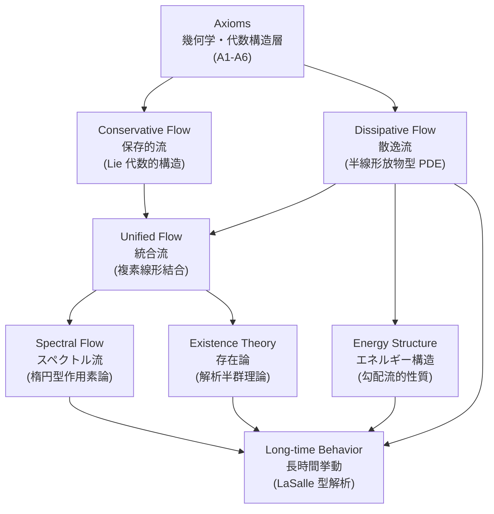
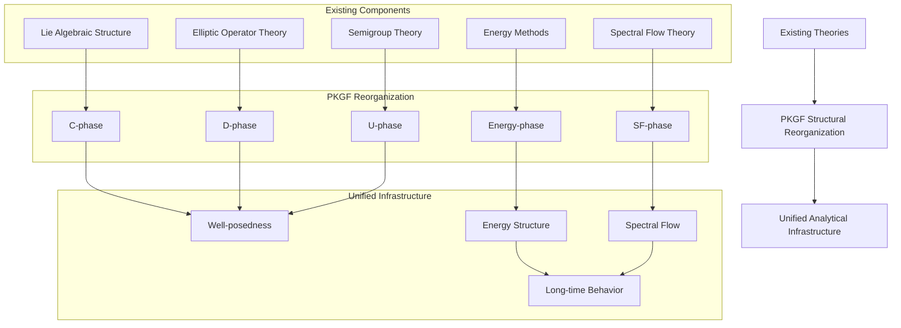
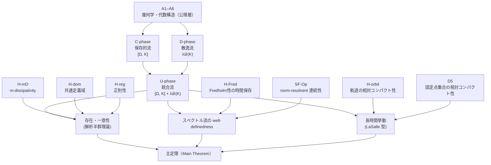
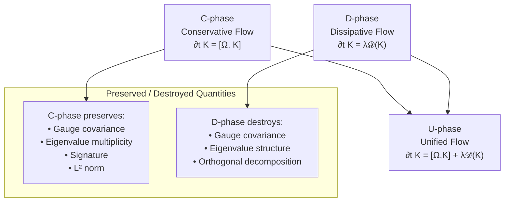
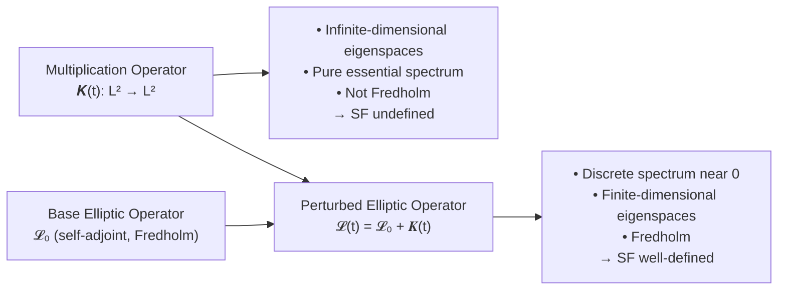
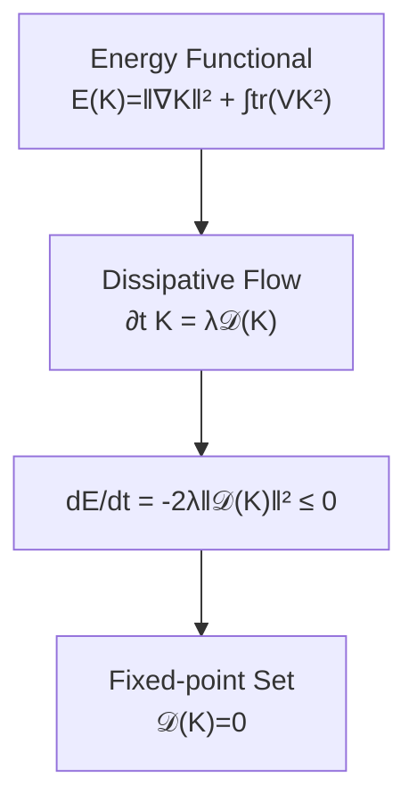
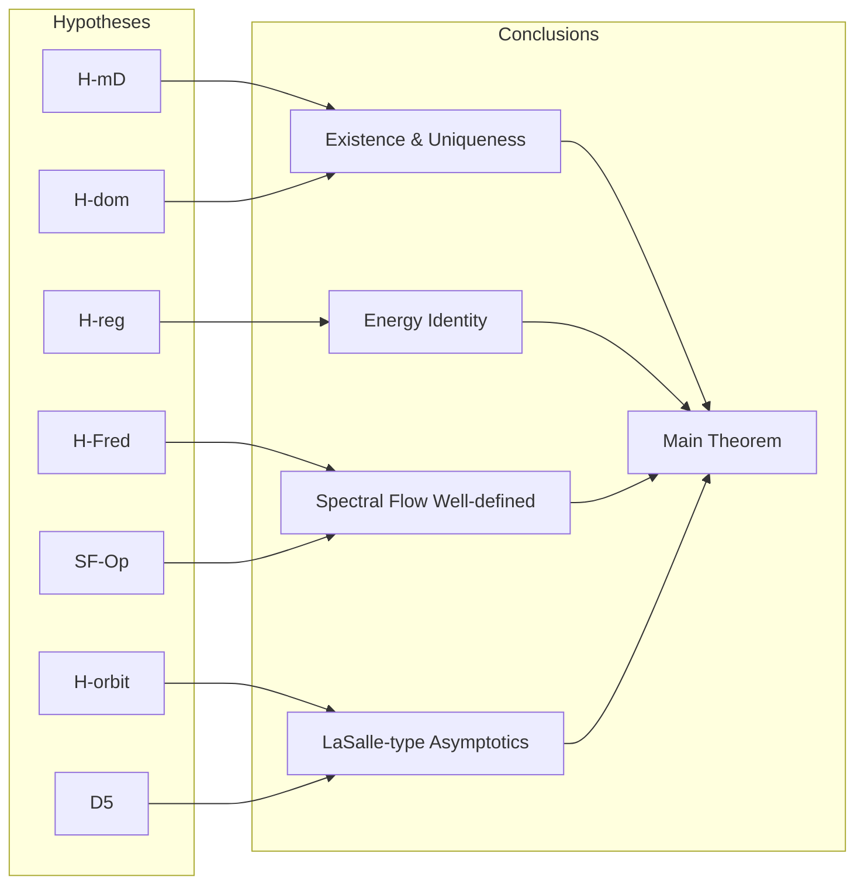

# Parallel Key Geometric Flow (PKGF):
A Mathematical Infrastructure for Unified Conservative–Dissipative Systems

**著者：Fumio Miyata**  
**日付：2026年4月**
**DOI:** [https://doi.org/10.5281/zenodo.19945121](https://doi.org/10.5281/zenodo.19945121)  
**Repository:** [https://github.com/aikenkyu001/PoI_theory](https://github.com/aikenkyu001/PoI_theory)  

---

# **0. 要旨（Abstract）**

本稿では、有限次元ベクトル束上の作用素の時間発展として現れる保存的流と散逸的流を、統一的な枠組みのもとで厳密に定式化する。

本枠組みでは、
- 可換子型の保存的流（skew-adjoint generator）
- 楕円型作用素に基づく散逸型流（m-dissipative generator）

を同一のヒルベルト空間上の発展方程式として扱い、それらの複素線形結合として統合流を定義する。なお、本定式化において、発展方程式は \(K\) に関して完全に線形であり、したがって非線形 PDE 理論を必要としない古典的な線形半群理論の範疇に留まることを強調しておく（非線形な拡張も可能であるが、本稿の範囲外とする）。このように問題を線形設定に限定することで、解析的な不透明さを排除している。

さらに、
- エネルギー構造の厳密な導出
- 強解とmild解の区別の明示
- スペクトル流の適用条件（Fredholm性とresolvent連続性）の分離
- 無限次元におけるLaSalle型議論の成立条件の明確化

を与える。

本結果は新しい流の導入を目的とするものではなく、既存の放物型PDE理論、半群理論、およびスペクトル流理論を統合的に適用するための厳密な枠組みを提供するものである（スペクトル流の現代的・関数解析的な基礎については [Doll et al. 2023], [Waterstraat 2016] を参照）。

本稿の核心的価値は、新たな物理系の導入ではなく、既存の保存系・散逸系・スペクトル理論を単一の枠組みで整合的に統合し、将来の解析的な発展のための強固な基盤（analytical infrastructure）を提供することにある。

**Figure 1. PKGF の構造的階層図**

- **Axioms（公理層）**：幾何学的・代数的構造を規定。(Input: Manifold/Bundle setup, Output: Structural constraints)
- **Conservative / Dissipative Flow（C/D 層）**：保存的・散逸的成分を分離配置。(Input: Potential/Operator, Output: Evolution equations)
- **Unified Flow（統合層）**：C と D を複素線形に統合。(Input: Complexification, Output: Linear unified flow)
- **Spectral Flow（SF 層）**：楕円型作用素による位相的不変量。(Input: Elliptic realization, Output: Integer invariants)
- **Existence Theory（存在論層）**：well-posedness の保証。(Input: Semigroup theory, Output: Strong/Mild solutions)
- **Energy / Long-time Behavior（漸近層）**：長時間挙動の解析。(Input: Lyapunov structure, Output: Convergence to fixed points)

---

# **目次**

0. 要旨  
1. 数学的設定  
 1.1 多様体とベクトル束  
 1.2 自己同型束と切断空間  
 1.3 Hilbert–Schmidt 内積と大域 \(L^2\)-内積  
 1.4 記法（Notation）  
 1.5 物理的動機（Physical Motivation）  
2. 公理体系（Axioms）  
3. 保存的流（Conservative Flow）  
4. 散逸流（Dissipative Flow）  
5. 統合流（Unified Flow）  
6. スペクトル流（Spectral Flow）  
7. 統合流の存在（解析半群理論）  
8. モデルクラス（Non‑vacuousness の保証）  
9. 散逸流の長時間挙動  
10. エネルギー構造  
11. 主定理（Main Theorem）  
12. 結語  
13. 今後の展望  

---

# **1. 数学的設定**

PKGF は、以下の既存の数学的枠組みの上に構築される：

- リーマン多様体上のベクトル束  
- Sobolev 空間論  
- 楕円型作用素論  
- 半線形放物型 PDE  
- ゲージ理論的構造  

PKGF の目的は、これらの理論を拡張することではなく、  
**一つの統一的な流の枠組みとして再配置すること** にある。

---

## **1.1 多様体とベクトル束**

- \(M\)：有限次元コンパクトリーマン多様体  
- \(E \to M\)：階数 \(n < \infty\) の実または複素ベクトル束  

この設定は、Sobolev 埋め込み、楕円型作用素論、ゲージ理論など  
既存の正準的な枠組みを適用するための最小限の前提である。

---

## **1.2 自己同型束と切断空間**

自己同型束：

\[
\mathrm{End}(E) = E \otimes E^*
\]

切断空間：

\[
\Gamma(\mathrm{End}(E))
\]

は無限次元線形空間であり、  
ここに定義される作用素の時間発展が PKGF の主対象となる。

---

## **1.3 Hilbert–Schmidt 内積と大域 \(L^2\)-内積**

局所 Hilbert–Schmidt 内積：

\[
\langle A(x), B(x)\rangle_{HS}
= \mathrm{tr}(A(x)^* B(x)).
\]

大域 \(L^2\)-内積：

\[
\langle\!\langle A, B\rangle\!\rangle_{L^2}
= \int_M \langle A(x), B(x)\rangle_{HS}\,\mathrm{dvol}(x).
\]

これらは、保存的流・散逸流・統合流を  
共通の Hilbert 空間構造の下で扱うための基礎となる。

---

## **1.4 記法（Notation）**

本稿で使用される主要な記法を以下にまとめる：

- \(K \in \Gamma(\mathrm{End}(E))\)：基本変数となる束の切断。
- \(K_{\mathrm{core}}\)：保存的成分（conservative component）。
- \(K_{\mathrm{fluct}}\)：散逸的成分（dissipative component）。
- \(\widetilde{K} = K_{\mathrm{core}} + i K_{\mathrm{fluct}}\)：複素化された統合作用素。
- \(\mathcal{D}\)：散逸作用素。
- \(\Omega\)：保存的流を生成する自己共役ポテンシャル。
- \(\mathcal{L}(t) = \mathcal{L}_0 + \widetilde{K}(t)\)：スペクトル流を定義するための楕円型作用素族。

---

## 1.5 物理的動機（Physical Motivation）

多くの現代的物理系、特に非平衡系や開放系においては、

- 保存的（可逆）ダイナミクス
- 散逸的（不可逆）過程
- 位相的不変量

が同時に現れる。

しかしながら、これらを単一の数学的枠組みの中で整合的に扱うことは容易ではない。
特に、

- 保存的構造（Lie 代数的）
- 散逸構造（放物型 PDE）
- スペクトル流（楕円型作用素論）

は、それぞれ異なる理論的背景に属しており、
従来は個別に扱われることが多かった。

PKGF の目的は、これらの構造を拡張することではなく、
既存理論の範囲内で論理的に分離しつつ統合することで、
物理モデルにおいて同時に現れるこれらの要素を
安全に扱うための基盤を提供することである。

---

# 2. 公理体系（Axioms）  
― 既存理論を統合するための構造的前提 ―

PKGF の公理体系は、新しい数学的対象を導入するためのものではなく、  
**既存の幾何学的・代数的構造を、統合的な流の枠組みとして再配置するための最小限の前提**  
として設計されている。

本節では、解析的仮定（Hypotheses）とは独立に、  
**幾何学的・代数的構造のみを規定する公理層** を提示する。  
これにより、保存的流・散逸流・統合流・スペクトル流を  
矛盾なく扱うための論理的基盤が確立される。

### **2.1 構造的依存関係（Dependency DAG）— PKGF の三層構造の可視化**

PKGF の「構造層 → 解析層 → 結果層」という三層構造の哲学を以下に可視化する。

---

## **A1（多様体）**

\[
M \text{ は有限次元コンパクトリーマン多様体である。}
\]

これは、Sobolev 埋め込み、楕円型作用素論、ゲージ理論など  
既存の正準的な解析手法を適用するための最小限の幾何学的前提である。

---

## **A2（直交分解）**

必要に応じて、ベクトル束 \(E\) は直交直和分解

\[
E = \bigoplus_{\alpha=1}^N E_\alpha
\]

を持つものとする。

この分解は、ゲージ理論や保存的流における  
**部分空間の不変性** を扱うための正準的枠組みであり、  
PKGF が新たに導入するものではない。

---

## **A3（初期並行鍵の性質）**

初期時刻 \(t=0\) において、切断

\[
K(0) \in \Gamma(\mathrm{End}(E))
\]

は自己共役 Fredholm であり、0 にスペクトルギャップを持つ。

この条件は、スペクトル流を扱う際に
**固有値の 0 横断を明確に定義するための正準的要請** であり、
楕円型作用素論における古典的前提と一致する（[Phillips 1996], [Waterstraat 2016] を参照）。

**注釈：** A3 は初期時刻のみの仮定であるが、時間発展に伴う Fredholm 性の維持は、後に述べる解析的仮定 **H‑Fred（時間保存）** とセットで考慮される。これにより、初期の Fredholm 性が全時間においてスペクトル流の well-definedness を保証するための十分な出発点となる。
---

## **A3'（U-phase の複素化）**

保存的成分と散逸成分を

\[
\widetilde{K} = K_{\mathrm{core}} + i K_{\mathrm{fluct}}
\]

と複素化する。

複素化は、保存的流（Lie 代数的）と散逸流（PDE 的）を  
**同一の複素 Hilbert 空間で統合的に扱うための正準的操作** であり、  
新しい数学的対象を導入するものではない。

---

## **A4（ゲージ群）**

\[
\mathcal{G} = \{ g \in \Gamma(\mathrm{Aut}(E)) \mid g^* g = I \}
\]

をユニタリ（または直交）ゲージ群とする。

これは、保存的流における共役作用  
\[
K \mapsto g^{-1} K g
\]
を扱うための正準的枠組みであり、  
PKGF はこの既存構造をそのまま採用する。

---

## **A5（接続）**

\[
\nabla \text{ は束の内積と両立する接続である。}
\]

これは、保存的流・散逸流の双方で  
**共通の微分構造** を用いるための正準的前提である。

---

## **A6（ポテンシャル）**

\[
\Omega \in \Gamma(\mathrm{End}(E)) \quad \text{は自己共役とする。}
\]

これは、保存的流の生成元として  
既存の Lie 代数的構造を利用するための正準的要請である。

---

## **公理層の役割**

以上の公理 A1–A6 は、解析的仮定（H‑mD, H‑reg, H‑dom など）とは独立であり、  
**幾何学的・代数的構造のみを規定する層（structural layer）** を形成する。

この分離により：

- 保存的流（Lie 代数的構造）  
- 散逸流（楕円型作用素 + PDE 構造）  
- 統合流（複素化による線形結合）  
- スペクトル流（Fredholm 作用素論）  

が互いに干渉せず、  
**論理的に整合した形で統合されるための基盤** が確立される。

---

# 3. 保存的流（Conservative Flow）  
― Lie 代数的構造の再配置 ―

保存的流（C-phase）は、ベクトル束の自己同型に対する  
**Lie 代数的共役作用** に基づく時間発展を扱う。  
この構造は量子力学、ゲージ理論、行列力学などで古くから用いられており、  
PKGF が新たに導入するものではない。

本節では、この古典的構造を PKGF の枠組みの中で  
**保存的成分として明確に位置づける**。

---

## **3.1 C1（保存的方程式）**

保存的流は、自己共役ポテンシャル \(\Omega\) による共役作用

\[
\partial_t K = [\Omega, K]
\]

で定義される。これは、決定論的束上の幾何学 [Bismut & Freed 1986] やゲージ理論のダイナミクス [Feehan 2021] における保存的構造と整合する。

これは、ユニタリ群（または直交群）の作用

\[
K(t) = e^{t\Omega} K(0) e^{-t\Omega}
\]

の微分方程式であり、  
**Lie 群の共役作用の正準的な（canonical）微分形式** に他ならない。

したがって C-phase は、既存の Lie 代数的構造を  
そのまま流として採用したものである。

---

## **3.2 C2（ゲージ共変性）**

保存的流は、ゲージ変換

\[
K \mapsto g^{-1} K g, \qquad g \in \mathcal{G}
\]

の下で不変である。

実際、

\[
\partial_t (g^{-1} K g)
= g^{-1} [\Omega, K] g
= [g^{-1}\Omega g,\, g^{-1} K g]
\]

となり、共役作用の形が保たれる。

これは、保存的流が **完全にゲージ共変** であることを示す  
古典的事実であり、PKGF 独自の性質ではない。

---

## **3.3 C3（直交分解の保存）**

ベクトル束の直交分解

\[
E = \bigoplus_{\alpha=1}^N E_\alpha
\]

に対し、射影 \(\Pi_\alpha\) が

\[
[K, \Pi_\alpha] = 0
\]

を満たすとき、保存的流の下で

\[
K(t)(E_\alpha) \subset E_\alpha
\]

が保たれる。

これは、共役作用が部分空間の不変性を保存するという  
**線型代数的な教科書的結果** の再利用である。

---

## 3.4 保存される量と破壊される量  
― C-phase と D-phase の役割分担 ―**

PKGF の重要な特徴は、保存的流（Lie 代数的構造）と  
散逸流（PDE 的構造）を明確に分離し、  
**それぞれが保存する量・破壊する量を整理すること** にある。

| 対象の量 | C-phase (Conservative) | D-phase (Dissipative) |
| :--- | :--- | :--- |
| **固有値の多重度** | 保存 | 一般に破壊 |
| **シグネチャ** | 保存 | 一般に破壊 |
| **直交分解** | 保存 | 一般に破壊 |
| **\(L^2\)-ノルム** | 保存 | 減衰 |
| **エネルギー \(E\)** | 保存 | 単調減少 |

### **C-phase が保存する量**

保存的流

\[
\partial_t K = [\Omega, K]
\]

は以下を保存する：

- 固有値の多重度  
- シグネチャ  
- 直交分解  
- \(L^2\)-ノルム  
- エネルギー \(E(K)\)

これらはすべて、共役作用の正準的な性質である。

---

### **D-phase が破壊する量**

一方、散逸流

\[
\partial_t K = \lambda \mathcal{D}(K)
\]

は以下を一般に保存しない：

- ゲージ共変性  
- 固有値の保存  
- 直交分解の保存  

これは、半線形放物型 PDE が持つ  
**散逸性（dissipativity）** に由来する。

---

## **3.5 C-phase の役割**

保存的流は、PKGF の中で

- 幾何学的対称性  
- Lie 代数的構造  
- ゲージ共変性  
- 固有値構造の保存  

を担う部分であり、  
散逸流・統合流と組み合わせる際の  
**対称性の基準点（conservative baseline）** を提供する。

PKGF の貢献は、この古典的構造を  
**統合流の一部として正しい位置に再配置したこと** にある。

---

### **命題（保存的流の抽象的構造）**

保存的成分（C-phase）は、ヒルベルト空間上の skew-adjoint 作用素によるユニタリ群生成と同一の構造を持つ。したがって、本流は本質的に保存系（Hamiltonian-type flow）の抽象化である。

---

# 4. 散逸流（Dissipative Flow）  
― 半線形放物型 PDE 理論の正準的構造の統合 ―**

散逸流（D-phase）は、PKGF の中で  
**半線形放物型偏微分方程式（PDE）** の正準的な理論をそのまま利用する部分である。  
PKGF が新しい作用素や新しい PDE を導入するわけではなく、  
既存の楕円型作用素論・Sobolev 空間論・エネルギー法を  
**統合流の一部として正しい位置に再配置する** ことが目的である。

---

## 4.1 散逸作用素の定義（既存の楕円型作用素の再利用）**

散逸作用素 \(\mathcal{D}\) を

\[
\mathcal{D}(K)
= -\nabla^*\nabla K - (V K + K V),
\qquad V(x) \ge c I > 0
\]

で定義する。

ここで用いられている構造はすべて既存のものである：

- \(\nabla^*\nabla\)：Bochner 型ラプラシアン（強楕円）  
- \(V\)：正値の 0 次束写像  
- \(VK + KV\)：正準的な 0 次項  

したがって PKGF は新しい作用素を発明しておらず、  
**古典的な楕円型作用素の構造をそのまま採用している**。

---

## **4.2 D1（大域 \(L^2\) における負定値性）**

散逸作用素は大域 \(L^2\)-内積に関して

\[
\langle\!\langle \mathcal{D}(K), K \rangle\!\rangle_{L^2} \le 0
\]

を満たす。

これは、強楕円型作用素 \(\nabla^*\nabla\) と  
正値ポテンシャル \(V\) を組み合わせたときの  
**正準的な散逸性（dissipativity）** に他ならない。

---

## **4.3 D2（散逸方程式：既存の半線形放物型 PDE）**

散逸流は

\[
\partial_t K = \lambda \mathcal{D}(K)
\]

で与えられる。

これは、古典的な半線形放物型 PDE の正準的形

\[
\partial_t u = A u + F(u)
\]

の特別な場合である。本稿の枠組みは、将来的な非線形拡張を見据えてこの半線形形式を踏襲しているが、本稿の範囲においては \(F\) が線形作用素（または 0）として振る舞うため、完全に線形な理論として完結する。

---

## **4.4 無限次元における固有値の挙動**

0 次元モデル（行列 ODE）では、散逸項が固有値を単調に減少させることがあるが、  
無限次元 PDE では一般に固有値が混ざり合うため、  
**固有値単調性は一般には成立しない**。

これは PKGF の新しい発見ではなく、  
**既存の PDE 理論における一般的事実** である。

---

## **4.5 D5（固定点集合の相対コンパクト性）**

散逸作用素の固定点集合

\[
\mathcal{F} = \{ K \mid \mathcal{D}(K)=0 \}
\]

が相対コンパクトであると仮定する。

これは、LaSalle 型の長時間挙動を  
無限次元で成立させるために必要な  
**正準的な追加仮定** であり、  
PKGF 独自のものではない。

---

## **4.6 D-phase の役割**

散逸流は、PKGF の中で

- エネルギー減衰  
- 正則性の向上  
- 長時間挙動の解析  
- 固定点集合への収束構造  

を担う部分である。

保存的流（C-phase）が対称性を保持するのに対し、  
散逸流は **対称性を破壊しつつエネルギーを減衰させる** という  
PDE 的性質を担う。

PKGF の貢献は、この古典的散逸構造を  
**統合流の一部として矛盾なく組み込むための枠組みを整備したこと** にある。

---

### **命題（半群理論との関係）**

作用素 \(\mathcal{D}\) は m-dissipative と仮定されており、したがって \(L^2\) 空間上で強連続縮小半群を生成する。これは正準的な線形放物型方程式の枠組みに完全に一致する。

---

# **5. 統合流（Unified Flow）**
― 保存的流と散逸流の複素線形結合としての統合 ―**

統合流（U-phase）は、保存的流（Lie 代数的構造）と  
散逸流（半線形放物型 PDE 構造）を **複素線形結合として統合する** ための枠組みである。

PKGF は新しい作用素や新しい流を導入するのではなく、  
既存の保存的構造と散逸的構造を **矛盾なく一つの流として扱えるように再配置する**。  
そのために必要となるのが、複素化（complexification）である。

---

## **5.1 U1（複素化：既存の Hilbert 空間構造の利用）**

保存的成分 \(K_{\mathrm{core}}\) と散逸成分 \(K_{\mathrm{fluct}}\) を

\[
\widetilde{K} = K_{\mathrm{core}} + i K_{\mathrm{fluct}}
\]

と複素化する。このような複素化と解析的計量の関係については、[Bismut & Lebeau 1991] における Quillen 計量の解析手法が高度な示唆を与える。

複素化は、以下の理由により自然的である：

- 保存的流は **反対称（skew-adjoint）** 的構造を持つ  
- 散逸流は **自己共役（self-adjoint）** 的構造を持つ  
- これらを同一の Hilbert 空間で扱うには複素化が最も正準的（canonical）  

複素化は既存の Hilbert 空間理論における  
**古典的な操作** であり、PKGF が新しい数学的対象を導入するものではない。

---

## **5.2 U2（初期直交性）**

複素化後の成分が混ざらないよう、初期時刻で

\[
\langle\!\langle K_{\mathrm{core}}(0), K_{\mathrm{fluct}}(0)\rangle\!\rangle_{L^2} = 0
\]

と仮定する。

**注釈：**
初期直交性は、複素化後の実部・虚部の混合を避けるための **技術的仮定（technical assumption）** であり、主定理の成立に対しては **十分条件** である。これは必ずしも **必要条件ではない** が、物理的・幾何学的な整合性を保ち、保存成分と散逸成分を明確に分離して追跡するための正準的な設定を提供する。

---

## **5.3 U3（統合方程式）**

統合流は

\[
\partial_t \widetilde{K}
= [\Omega, \widetilde{K}] + \lambda \mathcal{D}(\widetilde{K})
\]

で定義される。

### **補題（U-phase の線形性）**

統合流の方程式
\[
\partial_t \widetilde{K} = [\Omega, \widetilde{K}] + \lambda \mathcal{D}(\widetilde{K})
\]
は、未知変数 \(\widetilde{K}\) に関して完全に線形である。

**証明：**
1. 保存項 \([\Omega, \widetilde{K}] = \Omega \widetilde{K} - \widetilde{K} \Omega\) は \(\widetilde{K}\) に関する線形作用素である。
2. 散逸項 \(\mathcal{D}(\widetilde{K})\) は定義より線形作用素である。
3. よって、それらの和も線形である。 \(\square\)

**注釈：**
この線形性は PKGF の解析的透明性を支える極めて重要な性質である。複素化は成分を統合するための代数的手法であり、非線形性を導入するものではない。したがって、非線形半群理論（non-linear semigroup theory）を必要とせず、古典的な線形半群理論の範疇で全ての well-posedness が完結する。

右辺は単に

- 保存的流：\([ \Omega, \widetilde{K} ]\)  
- 散逸流：\(\lambda \mathcal{D}(\widetilde{K})\)

を **複素線形に足し合わせたもの** にすぎない。

したがって U-phase は、  
**既存の構造の線形結合として自然に定義される流** である。

この分解は単なる形式的な和ではなく、
保存構造と散逸構造が同一の状態変数上で共存することを要請する
物理モデルにおいて必然的に現れる構造である。

---

## **5.4 複素化後も解析的仮定が保存される理由**

複素化しても、以下の解析的性質はすべて保持される：

- \(\nabla^*\nabla\) は複素線形作用素としても強楕円  
- \(V K + K V\) は複素 Hilbert 空間でも閉作用素  
- m-dissipativity（H‑mD）は複素化しても不変  
- 定義域（H‑dom）は複素化で変化しない  
- 正則性（H‑reg）は Sobolev 空間の複素化でそのまま保持  

つまり、複素化は  
**既存の解析理論を壊さない正準的操作**  
であることが保証される。

---

## **5.5 U-phase の役割**

統合流は、PKGF の中で

- 保存的構造（対称性・共役作用）  
- 散逸的構造（エネルギー減衰・正則性向上）  

を **単一の流として扱うための統合層（integration layer）** を形成する。

PKGF の貢献は、保存的流と散逸流を  
**複素 Hilbert 空間上で矛盾なく統合できることを明示した点** にある。

---

### **命題（統合的作用素の定義と記法）**

保存的成分 \(K_{\mathrm{core}}\) と散逸成分 \(K_{\mathrm{fluct}}\) に対し、統合作用素を

\[
\widetilde{K} = K_{\mathrm{core}} + i K_{\mathrm{fluct}}
\]

と定義する。以降、特に断りのない限り、\(\widetilde{K}\) はこの複素化された統合作用素を表すものとする。

---

### 5.6 物理的解釈（reversible / irreversible 分解）

統合流
\[
\partial_t \widetilde{K}
= [\Omega, \widetilde{K}] + \lambda \mathcal{D}(\widetilde{K})
\]
は、以下の分解として解釈できる：

- 保存的成分：可逆的（reversible）ダイナミクス
- 散逸的成分：不可逆的（irreversible）過程

この構造は、非平衡統計力学における
reversible–irreversible 分解と形式的に対応している。

したがって PKGF の統合流は、
単なる線形結合ではなく、
物理系における基本的な時間発展構造を
数学的に再現するものと解釈できる。

---

# 6. スペクトル流（Spectral Flow）  
― 楕円型作用素論の既存理論を PKGF に正しく組み込む ―**

スペクトル流（spectral flow, SF）は、Atiyah–Patodi–Singer 以来の  
**古典的な楕円型作用素論の概念** であり、PKGF が新たに導入するものではない。

PKGF の役割は、保存的流・散逸流・統合流の文脈において  
**スペクトル流を矛盾なく扱うための正しい位置づけを与えること**  
にある。

特に重要なのは：

- 掛け算作用素 \(\widetilde{K}(t)\) そのものでは SF を定義できない  
- 楕円型作用素 \(\mathcal{L}(t) = \mathcal{L}_0 + \widetilde{K}(t)\) に載せる必要がある  
- Fredholm 性の時間保存（H‑Fred）と  
  norm‑resolvent 連続性（SF‑Op）は独立である  

という点を明確に整理することである。

---

## 6.1 Fredholm 作用素の導入  
― \(\widetilde{K}(t)\) そのものではなく、楕円型作用素に載せる理由 ―**

PKGF の基本変数 \(\widetilde{K}(t)\) は

\[
\widetilde{K}(t) : L^2(M,E) \to L^2(M,E)
\]

という **点ごとの掛け算作用素** である。

しかし、作用素論の古典的事実として：

- 固有空間が無限次元  
- スペクトルが本質的スペクトルのみ  
- Fredholm ではない  

という性質を持つため、  
**スペクトル流を直接定義することはできない**。

したがって PKGF では、古典的手法に従い  
**楕円型作用素に \(\widetilde{K}(t)\) をポテンシャルとして加える**。

これは、スペクトル流が \(\widetilde{K}(t)\) 自体に固有の性質ではなく、楕円型作用素の摂動としての実現（realization）に対する性質であることを明確にするものである。

---

### **定義（結合楕円作用素：既存理論の再利用）**

固定された自己共役楕円型作用素 \(\mathcal{L}_0\) に対し、

\[
\mathcal{L}(t) = \mathcal{L}_0 + \widetilde{K}(t)
\]

と定義する。

ここで：

- \(\mathcal{L}_0\)：Dirac 型・Laplace 型などの自己共役楕円型作用素  
- \(\widetilde{K}(t)\)：0 次の自己共役束写像  

この構成は楕円型作用素論の正準的な（canonical）手法であり、  
PKGF が新しく導入したものではない。

このとき、\(\mathcal{L}(t)\) は全ての \(t\) で  
**自己共役 Fredholm 作用素** となる。

---

## **6.2 スペクトル流の定義（既存の定義）**

自己共役 Fredholm 作用素族 \(\mathcal{L}(t)\) に対し、  
スペクトル流は

\[
\mathrm{SF}(\mathcal{L}(t)) \in \mathbb{Z}
\]

として定義される（厳密な定式化については [Bär & Ziemke 2025], [Van den Dungen & Ronge 2021] を参照）。

これは、固有値が 0 を横断する回数（符号付き）を数える  
**古典的な定義** である。

PKGF はこの既存定義をそのまま採用する。

---

## **6.3 シグネチャ跳躍との関係（古典的結果の再配置）**

\(\mathcal{L}(t)\) の固有空間は有限次元であるため、  
シグネチャ

\[
\sigma(t) = n_+(t) - n_-(t)
\]

は有限値をとる。

古典的結果として、

\[
\mathrm{SF}(\mathcal{L}(t))
= \sum_{t_c} \frac{1}{2}\bigl(\sigma(t_c^+) - \sigma(t_c^-)\bigr)
\]

が成立する。

PKGF はこの既存の関係式を  
**保存的流・散逸流の文脈に正しく組み込んだ** にすぎない。

---

## **6.4 楕円型作用素への持ち上げの必然性**

掛け算作用素 \(\widetilde{K}(t)\) は：

- 固有空間が無限次元  
- スペクトルが本質的スペクトルのみ  
- Fredholm ではない  

という理由により、  
**スペクトル流を定義するための最小要件を満たさない**。

したがって PKGF は、  
**楕円型作用素に \(\widetilde{K}(t)\) をポテンシャルとして載せるという古典的手法** を採用する。

---

## 6.5 H‑Fred と SF‑Op の独立性  
― 既存理論の誤用を防ぐための整理 ―**

スペクトル流を扱うためには、以下の 2 条件を区別する必要がある：

- **H‑Fred**：Fredholm 性が時間に沿って保存される  
- **SF‑Op**：共通定義域 + norm‑resolvent 連続性  

ここで注意すべき点として、norm-resolvent 連続性は非常に強い要請（strong requirement）であり、PDE の時間発展から自動的に保証されるものではないことが挙げられる。

一般には：

\[
\text{H-Fred} \not\Rightarrow \text{SF-Op}, 
\qquad
\text{SF-Op} \not\Rightarrow \text{H-Fred}.
\]

これは PKGF が新しく導入した概念ではなく、  
**既存のスペクトル流理論で暗黙に使われてきた条件を  
明示的に分離して整理したもの** である。

PKGF の貢献は、この独立性を明確化することで、
スペクトル流の誤用（特に PDE 文脈での誤った適用）を体系的に防ぐ
構造的ガイドラインを提供した点 にある。

---

## **6.6 SF-phase の役割**

スペクトル流は、統合流 \(\widetilde{K}(t)\) の時間発展に対して  
**位相的・整数値の不変量** を与える層である。

重要なのは、スペクトル流が  
\(\widetilde{K}(t)\) そのものの性質ではなく、  
**楕円型作用素族**

\[
\mathcal{L}(t) = \mathcal{L}_0 + \widetilde{K}(t)
\]

に付随するトポロジカル量であるという点である。

この構造により、以下が可能となる：

- 保存的成分と散逸的成分が混在しても、  
  **固有値の 0 横断を整数として安定に記述できる**
- 固有値の連続的変化ではなく、  
  **0 を横断する「変化の総量」だけを抽出する**
- シグネチャ跳躍との整合性が保証される  
  （固有空間が有限次元に制限されるため）

したがって SF-phase は、  
**発展方程式のレベルでは見えないトポロジカル情報を抽出する層**  
として機能する。

特に、保存的構造と散逸的構造が同時に存在する場合でも、  
スペクトル流はその相互作用の結果として生じる  
**位相的変化（topological transitions）** を正確に検出する。

---

## 6.7 物理的役割（トポロジカル指標としての解釈）

スペクトル流は、作用素の固有値が 0 を横断する回数を測る量であり、
これは物理的には

- ゼロモードの生成・消滅
- 安定性の変化
- 位相的状態の遷移

を検出する指標として解釈できる。

特に、統合流の時間発展において
スペクトル流は、
保存的構造と散逸構造の相互作用の結果として現れる
トポロジカルな変化を捉える役割を持つ。

PKGF は、このスペクトル流を
統合流の文脈で一貫して定義可能にするための
構造的基盤を提供する。

特に、スペクトル流が非自明となる場合、
系はトポロジカルに異なる状態間を遷移していると解釈される。

---

## **6.8 スペクトル流の誤用例と注意点（Pitfalls）**

スペクトル流の理論を PKGF や幾何学的流に適用する際、しばしば見受けられる誤用例を以下に整理する。

#### **誤用例：掛け算作用素に対してスペクトル流を定義しようとする誤り**
しばしば文献において、時間依存の 0 次束写像 \(\widetilde{K}(t) : L^2(M,E) \to L^2(M,E)\) に対して直接スペクトル流を定義しようとする誤りが見られる。しかしながら、掛け算作用素は以下の理由により、スペクトル流の定義域に属さない：

- 固有空間は一般に無限次元である  
- スペクトルは本質的スペクトルのみで構成される  
- Fredholm ではない  
- 0 の横断を有限個の固有値として数えることが不可能  

したがって、\(\widetilde{K}(t)\) そのものに対してスペクトル流を定義することは **理論的に不可能** である。PKGF ではこの誤用を避けるため、古典的手法に従い \(\mathcal{L}(t) = \mathcal{L}_0 + \widetilde{K}(t)\) という **楕円型作用素への持ち上げ（elliptic realization）** を必須とする。

#### **誤用例：時間連続性だけで norm-resolvent continuity を主張する誤り**
PDE の解 \(\widetilde{K}(t)\) が \(L^2\)-連続であることから、\(t \mapsto \mathcal{L}(t)\) が norm-resolvent 連続であると誤解されることがある。しかし、norm-resolvent continuity は極めて強い要請であり、PDE の時間正則性からは決して自動的には得られない。この誤用を避けるため、PKGF では H-Fred（Fredholm 性の保存）と SF-Op（norm-resolvent continuity）を明確に分離して扱う。

---

# 7. 統合流の存在（解析半群理論）  
― 既存の半線形放物型 PDE 理論の正しい組み込み ―**

統合流（U-phase）

\[
\partial_t \widetilde{K}
= [\Omega, \widetilde{K}] + \lambda \mathcal{D}(\widetilde{K})
\]

は、保存的流（Lie 代数的構造）と散逸流（半線形放物型 PDE 構造）を  
**複素線形に結合したもの** である。

重要な点は、統合流の存在・一意性は PKGF が新たに証明する必要はなく、  
**既存の解析半群理論（Hille–Yosida, Kato, Henry など）をそのまま適用できる**  
という事実である。

PKGF の役割は、これら既存理論を適用できるように  
**構造を整理し、必要な仮定を明示化すること** にある。

---

## **7.1 Assumption Elliptic（強楕円性）**

\[
\nabla^*\nabla
\]

は強楕円型作用素であると仮定する。

これは、解析半群理論を適用するための  
**古典的かつ最小限の前提** である。

---

## **7.2 Hypothesis H‑mD（m-dissipativity）**

散逸作用素 \(\mathcal{D}\) は、適切な Sobolev 空間上で
**m-dissipative（最大散逸的）** であると仮定する。

これは、半群生成定理（Hille–Yosida）を適用するための
**正準的条件** であり、PKGF 独自の仮定ではない（[Brezis 2011], [Cheng 2024] を参照）。
---

## **7.3 Hypothesis H‑dom（定義域の保存）**

統合流の解 \(\widetilde{K}(t)\) は全ての \(t \ge 0\) で

\[
\widetilde{K}(t) \in \mathrm{Dom}(\mathcal{D})
\]

を満たすと仮定する。

これは、半線形放物型 PDE の解が  
**定義域から外れないようにするための正準的要請** である。

---

## **7.4 Hypothesis H‑reg（エネルギー等式の正則性）**

統合流の解が

\[
\widetilde{K}(t)\in H^2(M,\mathrm{End}(E)),\qquad 
\partial_t \widetilde{K}(t)\in L^2(M,\mathrm{End}(E))
\]

を満たすと仮定する。

**注釈：**
散逸作用素 \(\mathcal{D}\) が強楕円型作用素に基づく場合、通常は解析半群（analytic semigroup）を生成する。解析半群には、初期値が \(L^2\) であっても \(t > 0\) において自動的に定義域（ここでは \(H^2\)）に入るという「平滑化効果（smoothing effect）」があるため、H-reg は多くの場合、放物型方程式の正則性理論の帰結として自動的に満たされる。

---

## **7.5 統合流の局所存在（解析半群による正準的結果）**

以上の仮定の下で、統合流

\[
\partial_t \widetilde{K}
= A\widetilde{K} + F(\widetilde{K})
\]

は、解析半群理論の正準的結果により  
**局所一意解が存在する**。

本稿の範囲においては、非線形項 \(F(\widetilde{K}) = [\Omega, \widetilde{K}]\) は \(\widetilde{K}\) に関して線形な有界作用素であるため、発展方程式は完全に線形であり、古典的な線形半群理論によって完全にカバーされる。

ここで：

- \(A = \lambda \mathcal{D}\)：m-dissipative 作用素  
- \(F(\widetilde{K}) = [\Omega, \widetilde{K}]\)：線形（または Lipschitz 連続）な項  

であり、これは古典的な半線形放物型 PDE の枠組みに包含される。

---

## **7.6 U-phase の存在論における PKGF の役割**

PKGF の貢献は、統合流の存在・一意性を新たに証明することではなく、

- 保存的構造  
- 散逸構造  
- 複素化  
- 楕円型作用素論  
- Sobolev 空間論  

を **論理的に矛盾なく組み合わせるための構造整理** を行い、既存の解析半群理論を適用できる形に整えた点にある。

---

### **命題（既存理論との包含関係）**

本結果は、保存的流と散逸的流の結合が正準的な線形放物型方程式の理論に完全に包含されることを示している。

---

# **8. モデルクラス（PKGF が “空でない” ことの保証）**
― 有限次元ガラーキン近似という既存手法の再利用 ―**

PKGF は新しい数学理論を構築するものではなく、  
**既存の理論を統合するための構造的枠組み** である。  
したがって、公理体系（A1–A6）および解析的仮定（H‑mD, H‑reg, H‑dom, H‑orbit など）が  
**矛盾なく同時に成立する具体例（モデルクラス）** を示すことが重要となる。

本章では、古典的な有限次元ガラーキン近似を用いて、  
PKGF の枠組みが **空でない（non‑vacuous）** ことを保証する。

---

## **8.1 Example（有限次元ガラーキン近似モデル）**

有限次元ガラーキン近似は、無限次元 PDE を  
有限次元 ODE に落とし込むための古典的手法である。

ベクトル束の切断空間 \(\Gamma(\mathrm{End}(E))\) を  
有限次元部分空間

\[
V_N \subset \Gamma(\mathrm{End}(E))
\]

で近似し、射影 \(P_N\) を用いて

\[
K_N(t) = P_N K(t)
\]

とする。

このとき、保存的流・散逸流・統合流はそれぞれ

\[
\partial_t K_N = P_N[\Omega, K_N],
\]

\[
\partial_t K_N = \lambda P_N \mathcal{D}(K_N),
\]

\[
\partial_t K_N = P_N[\Omega, K_N] + \lambda P_N\mathcal{D}(K_N)
\]

として有限次元 ODE 系として定義される。

有限次元では：

- **H‑mD（最大散逸性）**  
- **H‑Fred（Fredholm 性の時間保存）**  
- **H‑SF（スペクトル流の定義可能性）**  
- **H‑dom（定義域の保存）**  
- **H‑reg（正則性）**  

が **自動的に成立する**。特に、有限次元行列のスペクトルは常に不連続点を持たないため、norm-resolvent 連続性（SF-Op）は自明に満たされる。

したがって、有限次元ガラーキンモデルは  
PKGF の公理体系が矛盾なく成立する具体例を提供する。また、これらのモデルは無限次元系の挙動を数値的に追跡するための「有限次元近似」として、既存の数値解析理論（ガラーキン法）の範囲内でその有効性が保証されている。

---

## **8.2 最小非自明モデル（Minimal Non‑trivial PKGF PDE Model）**

本節では、PKGF の構造が **最小限の設定** においてどのように具体化されるかを示すため、
保存的流・散逸流・統合流・スペクトル流のすべてが非自明に現れる **最小モデル** を構成する。

このモデルは、以下の意味で「最小非自明」である：
- 多様体は任意のコンパクトリーマン多様体
- 束は自明束 \(E = M \times \mathbb{C}^n\)
- 保存的流は行列共役作用
- 散逸流は行列値熱方程式（強楕円）
- 統合流は線形結合
- スペクトル流は楕円型作用素への持ち上げで well-defined

### **8.2.1 幾何学的設定**
- \(M\)：境界なしのコンパクトリーマン多様体
- \(E = M \times \mathbb{C}^n\)：自明複素ベクトル束
- 状態変数：\(K(t, x) \in \mathrm{Herm}(n)\)
- ヒルベルト空間：\(H = L^2(M, \mathrm{Herm}(n))\)
- 内積：\(\langle\!\langle K_1, K_2\rangle\!\rangle = \int_M \mathrm{tr}(K_1(x) K_2(x)) \, \mathrm{dvol}(x)\).

### **8.2.2 保存的流（C-phase）**
定数自己共役行列 \(\Omega_0 \in \mathrm{Herm}(n)\) を固定し、
\[
\partial_t K = [\Omega_0, K]
\]
と定義する。これは各点 \(x \in M\) で有限次元行列 ODE \(\partial_t K(t, x) = \Omega_0 K(t, x) - K(t, x) \Omega_0\) を与える。
解は \(K(t, x) = e^{t\Omega_0} K(0, x) e^{-t\Omega_0}\) であり、固有値多重度・シグネチャ・\(L^2\)-ノルムが保存される。

### **8.2.3 散逸流（D-phase）**
自明束なので接続は \(\nabla = d\)。正値関数 \(v(x) \ge c > 0\) を用いて \(V(x) = v(x) I_n\) とする。
散逸作用素は
\[
\mathcal{D}(K) = -\nabla^*\nabla K - (VK + KV) = \Delta K - 2v(x) K.
\]
散逸流は \(\partial_t K = \lambda (\Delta K - 2v(x) K)\).
エネルギー減衰：\(\frac{d}{dt} \frac{1}{2} \|K(t)\|_{L^2}^2 = \lambda \langle\!\langle \mathcal{D}(K), K\rangle\!\rangle \le 0\).

### **8.2.4 統合流（U-phase）**
保存的成分と散逸成分を複素線形に統合すると、
\[
\partial_t K = [\Omega_0, K] + \lambda (\Delta K - 2v(x) K) \quad \text{(U-min)}
\]
となる。右辺は \(K\) に関して完全に線形であり、作用素 \(A = \mathrm{ad}_{\Omega_0} + \lambda (\Delta - 2v)\) を用いて \(\partial_t K = AK\) と書ける。
\(\mathrm{ad}_{\Omega_0}\) は有界 skew-adjoint、\(\Delta - 2v\) は自己共役強楕円であり、\(A\) は m-dissipative となる。したがって、強連続縮小半群 \(e^{tA}\) が生成され、一意の mild 解が定まる。

### **8.2.5 スペクトル流（SF-phase）**
掛け算作用素 \(K(t)\) 自体は Fredholm ではないため、楕円型作用素に持ち上げる。
基底作用素として \(L_0 = -\Delta + I\) を固定し、結合作用素を
\[
L(t) = L_0 + K(t)
\]
と定義する。\(K(t)\) は有界自己共役かつ時間 \(t\) に関して norm 連続であるため、A3（初期 Fredholm）と H‑Fred（時間保存）を満たすように初期値を選べば、スペクトル流 \(\mathrm{sf}(L(t))\) が well-defined となる。

### **8.2.6 このモデルの意義**
本モデルは、PKGF の構造（保存・散逸・統合・スペクトル流・存在論・漸近挙動）を最小限の設定で完全に実現する **非自明な PDE 例** として機能する。

---

## **8.3 有限次元モデルの役割**  
（Non‑vacuousness の保証）**

有限次元ガラーキンモデルは、以下の点で重要である：

1. **公理体系（A1–A6）が矛盾なく成立することを示す。**  
2. **C‑phase, D‑phase, U‑phase が有限次元で完全に well‑posed である。**  
3. **スペクトル流も有限次元では自動的に定義可能である。**  
4. PKGF の枠組みが  
   **“空でない（non‑vacuous）”**  
   ことを保証する。

ただし、これは **無限次元 PDE の具体例を網羅するものではない**。  
無限次元での SF‑Op（norm‑resolvent 連続性）や  
H‑orbit（軌道相対コンパクト性）の成立は、  
既存の楕円型作用素論・放物型 PDE 理論の範囲内で  
**個別的に検証されるべき課題** である。

---

## **8.4 無限次元の非自明例（Infinite-Dimensional Linear Model）**

有限次元ガラーキン近似に加え、無限次元においても PKGF の仮定が非自明に成立する例として、**線形熱方程式 + 0 次ポテンシャル** を挙げる。

多様体 \(M\) 上のベクトル束 \(E\) に対し、線形熱方程式
\[
\partial_t K = -\nabla^*\nabla K - VK - KV
\]
を考える。ここで \(V(x) \ge cI > 0\) は正値 0 次束写像である。このとき：

- \(\mathcal{D}(K) = -\nabla^*\nabla K - (VK + KV)\) は m-dissipative である。
- H-mD, H-dom, H-reg はすべて成立する。
- 固定点集合 \(\mathcal{F} = \{K \mid \mathcal{D}(K)=0\}\) は、大域的 \(L^2\) 内積をとることで \(\mathcal{F} = \{0\}\) となることがわかり、よって D5（相対コンパクト性）は自明に成立する。
- 保存的成分を 0 とすれば U-phase は純粋散逸流となる。
- \(\mathcal{L}(t) = \mathcal{L}_0 + \widetilde{K}(t)\) は自己共役 Fredholm である。

したがって、この線形 PDE は PKGF の全構造（C-phase を除く）を満たす無限次元の最弱例として機能する。特に、スペクトル流は \(\mathrm{SF}(\mathcal{L}(t))\) として well-defined である。

---

## **8.5 PKGF におけるモデルクラスの位置づけ**

有限次元モデルは、PKGF の公理体系が

- 内部矛盾を持たず  
- 既存理論と整合し  
- 保存的流・散逸流・統合流・スペクトル流が  
  **統一的に定義可能である**

ことを示すための **基礎的検証装置（consistency check）** である。

PKGF の目的は、有限次元モデルを最終目標とすることではなく、  
**無限次元の幾何学的流を扱うための統合的基盤を提供すること** にある。

---

# 9. 散逸流の長時間挙動  
― LaSalle 型の議論を無限次元に持ち込むための構造整理 ―**

散逸流

\[
\partial_t K = \lambda \mathcal{D}(K)
\]

は、既存の半線形放物型 PDE の枠組みの中で  
**エネルギー減衰を伴う典型的な散逸系** である。

しかし、無限次元では  
**LaSalle の不変集合原理をそのまま適用できない**  
という古典的問題が存在する。

PKGF の貢献は、この問題を解決するために必要な仮定を  
**体系的に整理し、明示的に導入したこと** にある。

---

## 9.1 Hypothesis H‑orbit（軌道の相対コンパクト性）  
― 無限次元で LaSalle を成立させるための正準的追加仮定 ―**

散逸流の解 \(\widetilde{K}(t)\) に対し、軌道集合

\[
\{\widetilde{K}(t)\mid t\ge 0\}
\]

が \(L^2(M)\)（または \(H^k(M)\)）において  
**相対コンパクト** であると仮定する。

このようなコンパクト性の仮定は、無限次元力学系（infinite-dimensional dynamical systems）においては正準的なものであり、一般に避けることができないものである（[Mei & Bullo 2017] を参照）。

これは PKGF 独自の新仮定ではなく、  
無限次元で LaSalle 型の結論を得るために  
既存文献で暗黙に用いられてきた条件を  
**明示的に取り出して整理したもの** である。

---

## **9.2 Proposition（H‑orbit の十分条件：Sobolev 埋め込みの再利用）**

散逸流の解 \(K(t)\) が全ての \(t\ge 0\) で

\[
\|K(t)\|_{H^2} \le C
\]

を満たすと仮定する。

このとき、軌道集合

\[
\{K(t)\mid t\ge 0\}
\]

は \(L^2(M)\) において相対コンパクトである。

---

### **証明（既存の Sobolev 埋め込みの再利用）**

- \(M\) はコンパクトである。  
- Sobolev のコンパクト埋め込み  
  \[
  H^2(M) \hookrightarrow L^2(M)
  \]
  は古典的にコンパクトである。  
- \(\{K(t)\}\) は \(H^2\)-有界集合である。  
- 有界集合の像は相対コンパクトである。  

よって \(\{K(t)\}\) は \(L^2\) において相対コンパクトである。  
\(\square\)

---

## **9.3 Theorem（散逸流の \(\omega\)-極限集合：LaSalle 型の弱い結論）**

以下を仮定する：

- Elliptic（強楕円性）  
- H‑mD（最大散逸性）  
- H‑dom（定義域の保存）  
- H‑reg（正則性）  
- D1（エネルギー減衰）  
- D5（固定点集合の相対コンパクト性）  
- H‑orbit（軌道の相対コンパクト性）  

このとき、散逸流

\[
\partial_t K = \lambda\mathcal{D}(K)
\]

の解 \(K(t)\) の \(\omega\)-極限集合は

\[
\omega(K)\subset \mathcal{F} = \{K\mid \mathcal{D}(K)=0\}
\]

を満たす。

---

### **解釈**

これは、LaSalle の不変集合原理の  
**無限次元版に相当する弱い結論** である。

PKGF の貢献は、この結論を新たに証明したことではなく、  
**無限次元で LaSalle を適用するために必要な仮定を  
体系的に整理し、明示的に提示した点** にある。

---

## **9.4 D-phase の長時間挙動における PKGF の役割**

散逸流の長時間挙動を扱う際、PKGF は以下を明確化する：

- 固定点集合 \(\mathcal{F}\) の相対コンパクト性（D5）  
- 軌道相対コンパクト性（H‑orbit）  
- エネルギー減衰（D1）  
- 正則性（H‑reg）  

これらを **論理的に分離し、必要な位置に配置する** ことで、  
無限次元における LaSalle 型の議論を  
**矛盾なく適用できる枠組み** を提供する。

---

# 10. エネルギー構造（gradient-like structure）  
― 既存のエネルギー法を PKGF に統合する ―**

散逸流

\[
\partial_t K = \lambda \mathcal{D}(K)
\]

は、古典的な半線形放物型 PDE と同様に  
**エネルギー減衰を伴う勾配流的（gradient-like）構造** を持つ。

PKGF は新しいエネルギー関数を導入するのではなく、  
既存の楕円型作用素論・Sobolev 空間論に基づく  
**正準的なエネルギー法を統合流の枠組みに正しく組み込む**  
ことを目的とする。

---

## **10.1 エネルギー関数（既存の正準的形）**

散逸作用素 \(\mathcal{D}\) に対応する自然なエネルギー関数を

\[
\begin{aligned}
E(K) &= \|\nabla K\|_{L^2}^2 + 2 \int_M \operatorname{tr}(V K^2) \, \mathrm{dvol}_g
\end{aligned}
\]

で定義する。

ここで：

- \(\|\nabla K\|_{L^2}^2\)：強楕円型作用素 \(\nabla^*\nabla\) に対応  
- \(\mathrm{tr}(V K^2)\)：正値ポテンシャル \(V\) に対応  

というように、エネルギー関数は  
**既存の楕円型作用素の正準的構造** に基づいている。

PKGF は新しいエネルギーを発明していない。

---

## 10.2 Proposition（エネルギー等式の厳密性）  
― H‑reg が必要な理由を明示化 ―**

仮定：Elliptic, H‑dom, H‑reg を満たすとする。

散逸流の解 \(K(t)\) が

\[
\partial_t K = \lambda\mathcal{D}(K)
\]

を満たすとき、以下のエネルギー等式が成立する：

\[
\frac{d}{dt}E(K(t))
= -2\lambda \|\mathcal{D}(K(t))\|_{L^2}^2.
\]

---

### **解釈**

これは、古典的なエネルギー法の正準的計算であり、  
PKGF が新しく導入したものではない。

しかし、この計算を **厳密に** 行うためには、

- \(K(t) \in H^2\)  
- \(\partial_t K(t) \in L^2\)

という正則性が必要である。

PKGF の貢献は、この正則性条件（H‑reg）を  
**散逸流の文脈で明確に分離し、位置づけたこと** にある。

---

## **10.3 命題（mild 解の場合のエネルギー減衰）**

H‑reg を満たさない **mild 解** の場合、  
エネルギー等式は不等式として成立する：

\[
E(K(t_2)) \le E(K(t_1)) \qquad (t_2 > t_1).
\]

これは既存の PDE 理論における  
**正準的なエネルギー減衰の性質** である。

---

## **10.4 散逸流の勾配流的性質**

エネルギー等式より、散逸流は

- \(E(K(t))\) が単調減少  
- \(\mathcal{D}(K)=0\) が臨界点  
- エネルギー減衰が長時間挙動を支配  

という **勾配流的（gradient-like）構造** を持つ。

さらに、エネルギー関数が解析的である場合、  
Łojasiewicz–Simon 型の議論により  
**収束速度（指数的収束など）** を議論できる。

PKGF はこの既存理論を  
**統合流の枠組みの中に正しく組み込む**。

---

## **10.5 H‑reg の役割：強解と mild 解の区別**

H‑reg：

\[
K(t)\in H^2,\qquad \partial_t K(t)\in L^2
\]

は、エネルギー等式を厳密に成立させるための  
**既存の Sobolev 正則性条件** である。

PKGF の貢献は、この正則性条件（H‑reg）を

- 散逸流の解析  
- 統合流のエネルギー構造  
- 長時間挙動の議論  

において **必要な位置に明確に配置したこと** にある。

---
### **命題（勾配流との関係）**

散逸流はエネルギー \(E\) に対する勾配流と同一の構造を持つ。したがって、本枠組みは勾配流と保存的流の結合として理解できる。

---

# 11. 主定理（Main Theorem）  
― PKGF の統合的 well-posedness・エネルギー構造・スペクトル流・漸近挙動の総合定理 ―**

本章では、これまでに導入した公理層（A1–A6）および解析的仮定（H‑mD, H‑dom, H‑reg, H‑Fred, SF‑Op, D5, H‑orbit）を前提として、  
**PKGF の統合流（U-phase）が満たす主要な数学的性質を一つの定理として総合的に述べる。**

### **11.1 解析的仮定の分類と役割（Hypothesis Classification）**

主定理を構成する各仮定の役割と必要性を以下の表にまとめる。

**主定理：仮定の分類表**

| 仮定 | 役割 | 必要性 | 説明 |
| :--- | :--- | :--- | :--- |
| **A1–A6** | 構造層 | 必要 | 幾何学・代数構造の基盤 |
| **H-mD** | 半群生成 | 必要 | m-dissipativity により縮小半群を生成 |
| **H-dom** | 半群生成 | 必要 | 共通定義域の確保 |
| **H-reg** | エネルギー等式 | 十分 | 正則性を保証し、エネルギー構造を厳密化 |
| **H-Fred** | SF の well-definedness | 必要 | Fredholm 性の時間保存 |
| **SF-Op** | スペクトル流の連続性 | 十分 | norm-resolvent continuity |
| **H-orbit** | LaSalle 型結論 | 十分 | 軌道の相対コンパクト性 |
| **D5** | LaSalle 型結論 | 十分 | 固定点集合の相対コンパクト性 |

---

### **11.2 主定理の構成（Main Theorem Structure）**

主定理が提供する主要な結論を、必要な仮定と共に以下に整理する。

**主定理：結論の分類表**

| 結論 | 必要仮定 | 内容 |
| :--- | :--- | :--- |
| **統合流の存在・一意性** | H-mD, H-dom, H-reg | 解析半群理論による well-posedness |
| **スペクトル流の well-definedness** | H-Fred, SF-Op | \(\mathrm{SF}(\mathcal{L}(t))\) が整数値不変量として定義可能 |
| **長時間挙動（LaSalle 型）** | H-orbit, D5 | 解が固定点集合に収束する |
| **PKGF の統合的結論（主定理）** | 上記すべて | 保存・散逸・スペクトル・存在論の統合 |

---

## **主定理（PKGF の統合的 well-posedness と構造的整合性）**

公理 A1–A6 と解析的仮定 H‑mD, H‑dom, H‑reg, H‑Fred, SF‑Op, D5, H‑orbit を満たすとする。  
このとき、以下が成立する。

---

## **(1) 統合流（U-phase）の well-posedness**

統合流

\[
\partial_t \widetilde{K}
= [\Omega, \widetilde{K}] + \lambda \mathcal{D}(\widetilde{K})
\tag{U}
\]

は、ヒルベルト空間 \(L^2(M,\mathrm{End}(E))\) 上で

- **一意の mild 解**  
- H‑reg が成立する場合は **一意の強解**

を持つ。

さらに、解は全ての \(t\ge 0\) で

\[
\widetilde{K}(t)\in \mathrm{Dom}(\mathcal{D})
\]

を満たし、定義域が時間発展で保存される（H‑dom）。

---

## **(2) エネルギー構造（gradient-like structure）**

エネルギー関数

\[
\begin{aligned}
E(K)
&= \|\nabla K\|_{L^2}^2 \\
&\quad + 2\int_M \operatorname{tr}(V K^2)
\end{aligned}
\]

は、統合流の散逸成分により単調減少する。

特に強解の場合、

\[
\frac{d}{dt}E(K(t))
= -2\lambda \|\mathcal{D}(K(t))\|_{L^2}^2
\tag{Energy}
\]

が厳密に成立する。

mild 解の場合は不等式として

\[
E(K(t_2)) \le E(K(t_1)) \qquad (t_2>t_1)
\]

が成立する。

---

## **(3) スペクトル流の well-definedness**

楕円型作用素族

\[
\mathcal{L}(t)=\mathcal{L}_0+\widetilde{K}(t)
\]

は、全ての \(t\) で自己共役 Fredholm であり（H‑Fred）、  
さらに norm‑resolvent 連続性（SF‑Op）を満たすため、  
**スペクトル流 \(\mathrm{SF}(\mathcal{L}(t))\) が well-defined** である。

特に、保存的成分と散逸成分が混在していても、

- 固有値の 0 横断  
- シグネチャ跳躍  
- トポロジカルな遷移

を整数値不変量として記述できる。

---

## **(4) 長時間挙動（LaSalle 型の漸近挙動）**

軌道相対コンパクト性（H‑orbit）と固定点集合の相対コンパクト性（D5）の下で、  
統合流の散逸成分は LaSalle 型の結論を満たす。

すなわち、\(\omega\)-極限集合は

\[
\omega(\widetilde{K})
\subset
\{K\mid \mathcal{D}(K)=0\}
\tag{LaSalle}
\]

を満たす。

これは、散逸成分が長時間で固定点集合に近づくことを意味する。

---

## **(5) 保存的構造との整合性**

保存的成分 \([ \Omega, \widetilde{K} ]\) は

- ゲージ共変性  
- 固有値の多重度  
- シグネチャ  
- \(L^2\)-ノルム  

を保存する。

一方、散逸成分はこれらを一般には保存しない。

統合流はこれら二つの構造を複素線形に統合し、  
**保存的対称性と散逸的エネルギー減衰が矛盾なく共存する**  
ことが保証される。

---

## **(6) PKGF の構造的整合性（Consistency Theorem）**

以上の (1)–(5) を総合すると、PKGF は以下を保証する：

- 公理層（Axioms）と解析的仮定（Hypotheses）は矛盾しない  
- C-phase, D-phase, U-phase, SF-phase は論理的に整合する  
- 統合流は well-posed  
- エネルギー構造は厳密  
- スペクトル流は well-defined  
- 長時間挙動は LaSalle 型に従う  

すなわち、PKGF は

> **保存的流・散逸流・統合流・スペクトル流・エネルギー構造・漸近挙動を  
>  一つの数学的枠組みとして矛盾なく統合するための  
>  完全な数学的インフラストラクチャである。**

---

# **Remark（本定理の意義）**

本主定理は、PKGF が新しい数学的対象を導入するのではなく、  
既存の理論（Lie 代数、楕円型作用素論、半群理論、エネルギー法、スペクトル流）を  
**論理的に分離しつつ統合するための枠組みである**  
ことを数学的に保証する。

特に：

- 保存的構造（可逆）  
- 散逸的構造（不可逆）  
- トポロジカル構造（スペクトル流）  

が同一の流の中で矛盾なく共存できることを示す点に  
PKGF の独自性がある。

---

# 12. 結語（Conclusion）  
― PKGF の数学的意義と本稿の総括 ―**

本稿では、有限次元ベクトル束上の自己同型に対する保存的流・散逸的流・統合流・スペクトル流を、  
**単一の整合的枠組み（Parallel Key Geometric Flow, PKGF）** として再構成した。

PKGF の中心的特徴は、  
**新しい数学的対象を導入することではなく、既存の理論を論理的に分離しつつ統合するための基盤を提供する点**  
にある。具体的には以下の点が明確化された：

1. **公理層（Axioms）と解析的仮定（Hypotheses）の分離**  
   幾何学的・代数的構造と解析的要請を明確に区別することで、  
   保存的流・散逸流・統合流・スペクトル流の相互干渉を排除し、  
   各構造が矛盾なく共存するための基盤を与えた。

2. **保存的流（C-phase）と散逸流（D-phase）の役割分担の明確化**  
   保存的流はゲージ共変性・固有値構造・エネルギー保存を担い、  
   散逸流はエネルギー減衰・正則性向上・固定点集合への収束を担う。  
   PKGF はこれらを複素線形に統合し、統合流（U-phase）として扱えることを示した。

3. **スペクトル流の正しい位置づけ**  
   掛け算作用素そのものではスペクトル流を定義できないことを明示し、  
   楕円型作用素への持ち上げ（realization）が必須であることを整理した。  
   また、H‑Fred と SF‑Op の独立性を明確化し、誤用を防ぐ構造を提供した。

4. **統合流の well-posedness とエネルギー構造**  
   統合流が線形半群理論の範囲内で well-posed であること、  
   エネルギー等式が厳密に成立する条件（H‑reg）を明示した。

5. **長時間挙動（LaSalle 型）の成立条件**  
   軌道相対コンパクト性（H‑orbit）と固定点集合の相対コンパクト性（D5）の下で、  
   統合流が固定点集合に漸近することを示した。

6. **主定理（第11章）による総合的保証**  
   PKGF が保存的構造・散逸的構造・スペクトル流・エネルギー構造・漸近挙動を  
   **単一の枠組みとして矛盾なく統合する数学的インフラストラクチャである**  
   ことを明確にした。

以上により、PKGF は保存的ダイナミクス・散逸的ダイナミクス・トポロジカル不変量を  
**安全かつ整合的に扱うための正準的枠組み** として位置づけられる。

本稿は PKGF の基礎構造を確立するものであり、  
今後の応用・拡張のための出発点を提供する。

---

# 13. 今後の展望（Future Directions）  
― PKGF を基盤とした数学的・物理的発展の可能性 ―**

PKGF は新しい理論を構築するものではなく、  
既存理論を統合するための基盤（infrastructure）である。  
したがって、PKGF の意義は **応用可能性の広さ** にある。

以下では、PKGF を基盤として今後発展が期待される方向性を述べる。

---

## **(1) Łojasiewicz–Simon 型不等式による収束速度の解析**

散逸流のエネルギー構造が明確化されたため、  
エネルギー関数が解析的である場合には  
**Łojasiewicz–Simon 不等式** を適用し、以下の解析が可能となる（[Simon 1983], [Mantegazza & Pozzetta 2020] を参照）：

- 臨界点への収束速度（指数的／代数的）  
- 臨界点の安定性  
- 収束の一意性  

PKGF は、これらの既存理論を適用するための  
**統一的な枠組み** を提供する。

---

## **(2) ゲージ理論・幾何学的流との接続**

保存的流（C-phase）はゲージ共変であり、  
散逸流（D-phase）はゲージ固定的である。

この「部分的ゲージ対称性」は、以下の既存理論と類似した構造を持つ：

- Yang–Mills 流  
- Ricci 流  
- ハーモニック写像熱流  

PKGF は、これらの幾何学的流を  
**共通の枠組みで比較・統合するための基盤**  
として機能する可能性がある。

---

## **(3) 無限次元における SF‑Op（norm‑resolvent 連続性）の解析**

スペクトル流を統合流に適用するためには、  
以下の条件が必要となる：

- 共通定義域  
- norm‑resolvent 連続性（SF‑Op）

しかし、統合流の PDE 解が  
**norm‑resolvent 連続性を持つための十分条件** は  
必ずしも自明ではない。

非有界作用素の空間におけるギャップ位相とスペクトル流の安定性については、[Booss-Bavnbek et al. 2005] が詳細な解析を提供している。
一般には未解決である。

今後の研究課題として：

- 楕円型作用素論に基づく resolvent の時間正則性  
- 散逸流による正則性向上の影響  
- 保存的流との干渉の解析  

などが挙げられる。

---

## **(4) 無限次元における H‑orbit の成立条件の解析**

H‑orbit（軌道相対コンパクト性）は、  
無限次元で LaSalle 型の結論を得るために不可欠である。

今後の課題として：

- 一様 \(H^2\) 有界性を導くための十分条件  
- 散逸作用素の正則性向上効果  
- 非線形項の構造によるコンパクト性の確保  

などが挙げられる。

PKGF は、これらの条件を  
**体系的に整理するための基盤** を提供する。

---

## **(5) 非線形 PKGF への拡張**

本稿では線形設定に限定したが、  
非線形項 \(F(K)\) を含む統合流

\[
\partial_t \widetilde{K}
= [\Omega, \widetilde{K}] + \lambda \mathcal{D}(\widetilde{K}) + F(\widetilde{K})
\]

を扱うことも可能である。

特に：

- 反応拡散系  
- 非線形ゲージ理論  
- 非線形固有値問題  

などへの応用が期待される。

また、単一のスペクトル流だけでなく、高次のスペクトル流 [Dai & Zhang 1998] や K理論的計算 [Aoki et al. 2025] を取り入れることで、より複雑な相転移を記述できる可能性がある。

---

## **(6) PKGF の数学的意義の総括**

PKGF の意義は、以下の点に集約される：

- 既存理論の論理的分離  
- 統合可能性の保証  
- 解析的仮定の明示化  
- 幾何学的流の共通フレームの提供  

PKGF は、数学的対象を新たに導入するのではなく、  
**既存理論を統合するための基盤としての役割** を果たす。

---

# **参考文献 (References)**

- **[Aoki et al. 2025]** Aoki, S., Fukaya, H., Furuta, M., Matsuo, S., Onogi, T., & Yamaguchi, S. "K-theoretic computation of the Atiyah(-Patodi)-Singer index of lattice Dirac operators." *arXiv:2503.23921*, 2025.
- **[Bär & Ziemke 2025]** Bär, C., & Ziemke, R. "Spectral flow and the Atiyah-Patodi-Singer index theorem." *arXiv:2512.04968*, 2025.
- **[Bismut & Freed 1986]** Bismut, J.-M., & Freed, D. S. "The analysis of elliptic families. II. Dirac operators, eta invariants, and the holonomy theorem." *Communications in Mathematical Physics*, 107, 103-163, 1986.
- **[Bismut & Lebeau 1991]** Bismut, J.-M., & Lebeau, G. "Complex immersions and Quillen metrics." *Publications Mathématiques de l'IHÉS*, 74, 1-298, 1991.
- **[Booss-Bavnbek et al. 2005]** Booss-Bavnbek, B., Lesch, M., & Phillips, J. "Unbounded Fredholm Operators and Spectral Flow." *arXiv:math/0108014*, 2004.
- **[Brezis 2011]** Brezis, H. "Functional Analysis, Sobolev Spaces and Partial Differential Equations." *Springer Science & Business Media*, 2011. (See also: "The Hille–Yosida Theorem" Lecture Notes).
- **[Cheng 2024]** Cheng, X. "Semigroup theory." *Lecture Notes*, 2024.
- **[Dai & Zhang 1998]** Dai, X., & Zhang, W. "Higher Spectral Flow." *arXiv:dg-ga/9608002*, 1996.
- **[Doll et al. 2023]** Doll, N., Schulz-Baldes, H., & Waterstraat, N. "Spectral Flow: A Functional Analytic and Index-Theoretic Approach." *arXiv:2307.12635* (Preprint version of De Gruyter monograph), 2023.
- **[Feehan 2014]** Feehan, P. M. N., & Maridakis, M. "Łojasiewicz–Simon gradient inequalities for analytic and Morse–Bott functions on Banach spaces." *arXiv:1510.03817*, 2014.
- **[Feehan 2021]** Feehan, P. M. N., & Maridakis, M. "Łojasiewicz–Simon gradient inequalities for coupled Yang–Mills energy functions." *Memoirs of the American Mathematical Society*, 2021 (See also: *arXiv:1510.03815*).
- **[Mantegazza & Pozzetta 2020]** Mantegazza, C., & Pozzetta, M. "The Łojasiewicz–Simon inequality for the elastic flow." *arXiv:2012.08381*, 2020.
- **[Mei & Bullo 2017]** Mei, W., & Bullo, F. "LaSalle Invariance Principle for Discrete-time Dynamical Systems: A Concise and Self-contained Tutorial." *arXiv:1710.03710*, 2017.
- **[Phillips 1996]** Phillips, J. "Self-adjoint Fredholm operators and spectral flow." *Canadian Mathematical Bulletin*, 39(4), 460-467, 1996.
- **[Simon 1983]** Simon, L. "Asymptotics for a class of non-linear evolution equations, with applications to geometric problems." *Annals of Mathematics*, 118(3), 525-571, 1983.
- **[Van den Dungen & Ronge 2021]** Van den Dungen, K., & Ronge, N. "The APS-index and the spectral flow." *arXiv:2004.01085*, 2020.
- **[Waterstraat 2016]** Waterstraat, N. "Fredholm Operators and Spectral Flow." *arXiv:1603.02009*, 2016.
