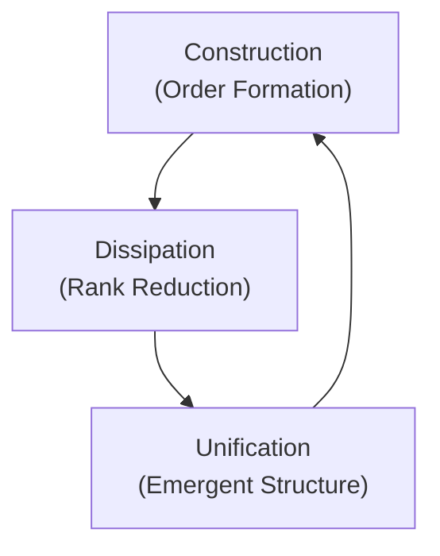
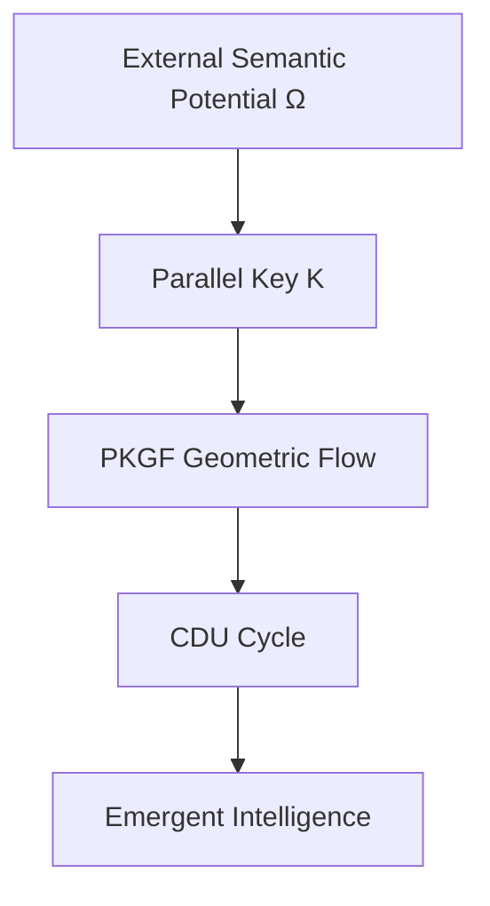
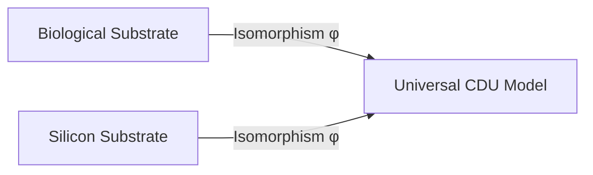

# Noetics - Physics of Intelligence

**Noetics** is a foundational scientific discipline that investigates the intrinsic principles, dynamics, and structures of intelligence by means of rigorous mathematical formalisms. It aims to identify and axiomatize the universal laws of intelligent behavior—**symmetry, dissipation, integration, and topological decision**—independent of any physical substrate or implementation. Noetics stands as a new fundamental science parallel to physics, grounded in mathematics yet distinct from both mathematics and physics in its object of study.

> **Intelligence is a physical phenomenon.**

* **PoI** is the first scientific framework that describes intelligence as **geometric dynamics on a manifold**.
* **PoI theory** is defined by the **PKGF axioms**, the **action principle**, and the **CDU cycle** — a unified theory of intelligence.

## Research Directory Index

### 📜 Core Foundations
* **[Noetics Founding Declaration](Noetics_en.md)** — Establishing intelligence as a physical science.
* **[PoI Theory Dissertation](PoI_Theory_en.md)** — Consolidated final theory and verification.
* **[PKGF Mathematical Engine](Parallel_Key_Geometric_Flow_en.md)** — The PDE and operator-theoretic backbone.

### 🔬 Specialized Extensions
* **[Spectral Flow in Unified Phase](PKGF_Spectral_Flow_Unified_Phase_en.md)** — Topological transitions and eigenvalue dynamics.
* **[Nonlinear Extensions](PKGF_Nonlinear_Extensions_en.md)** — Stability and long-time behavior under nonlinear perturbations.
* **[Modern Physics Correspondences](PKGF_structural_correspondence_modern_physics_en.md)** — Bridging PKGF with GENERIC, Onsager, and Gauge theories.
* **[Numerical Analysis (Galerkin)](PKGF_Finite_Dimensional_en.md)** — Finite-dimensional stability and discrete dynamics.
* **[Comparison with GENERIC/Onsager](PKGF_Generic_Onsager_en.md)** — Energy structure and non-equilibrium analysis.

### 📚 Resources
* **[PDF Bibliography](PDF_Bibliography.md)** — Central index of technical source materials.

---

## What PoI Solves

* Why do biological, silicon, and plant systems share the same intelligence structure?
* Why do learning, forgetting, collapse, and reconstruction universally occur?
* Why are **PoI‑SLAM** and **PoI‑OCR** more robust than conventional methods?

---

## PoI Structure Map

* **PKGF** — Geometric engine of intelligence
* **CDU** — Universal physical cycle
* **K-field** — Internal structural manifold
* **Substrate Invariance** — Intelligence beyond matter
* **Applications** — SLAM / OCR / LLM / Biology

---

## A New Science of Intelligence

The **Physics of Intelligence (PoI)** is a unified scientific framework that treats intelligence not as computation, but as a **geometric and physical process** occurring on a manifold.

Intelligence is modeled as the evolution of an internal structure called the **Parallel Key ($K$)**, driven by the universal physical cycle **CDU** and governed by the **Parallel Key Geometric Flow (PKGF)**.

PoI establishes that intelligence is a **substrate‑invariant physical phenomenon**—the same geometric laws operate in biological organisms, silicon chips, optical-digital hybrids, and even plant-based systems.

---

## The CDU Cycle: Universal Architecture of Intelligence

Every intelligent system—biological or artificial—follows the same irreversible three‑phase physical cycle:

| Phase | Name | Description |
| :--- | :--- | :--- |
| **C** | **Construction (Cause)** | Constructive PKGF builds structure and coherence. Formation of initial order in response to external semantic potential. |
| **D** | **Dissipation (Divergence)** | Destructive PKGF collapses structure and reduces dimension. Collapse, abstraction, and rank reduction of internal structure. |
| **U** | **Unification (Metabolism)** | Unified PKGF integrates both into a metabolic cycle. Reorganization into a new, higher‑order structure through phase transition. |

---

## PKGF: The Geometric Engine of Intelligence

### PKGF Overview
PKGF is the geometric law that governs how intelligence evolves. It unifies construction, deconstruction, and metabolic reconstruction into a single flow. The **Parallel Key ($K$)** is the internal structure whose dynamics define intelligence.

PKGF describes how the internal structure $K$ evolves on a manifold $M$ under:
* **Semantic Potential** $\Omega$
* **Geometric Connection** $\nabla$
* **Dissipative Operator** $D$
* **Gauge Symmetry** $g$

**The unified geometric field equation is:**
$$\nabla K = [\Omega, K] - \lambda D(K)$$

This single equation governs structure formation, structural collapse, phase transitions, dimensional jumps, and emergence of new invariants.

---

### 1. Constructive PKGF — Construction of Order
Constructive PKGF generates **order, coherence, and logical consistency**.

* **Fundamental Equation:**
  $$\nabla K = [\Omega, K]$$
* **Key Properties:**
    * **Sector Preservation:** $[K, \Pi_\alpha] = 0 \Rightarrow K(E_\alpha) \subset E_\alpha$
    * **Gauge Covariance:** Dynamics are invariant under $K \mapsto HKH^{-1}$
    * **Preservation of $\det(K)$:** Logical volume is conserved
* **Interpretation:** Constructive PKGF represents **learning, alignment, and coherent structure formation**.

---

### 2. Destructive PKGF — Geometry of Deconstruction
Destructive PKGF collapses structure, reduces rank, increases entropy, and generates singularities.

* **Fundamental Equation:**
  $$\dot{K} = -\lambda D(K)$$
* **Key Properties:**
    * **Rank Reduction:** $\text{rank}(K(t+dt)) \leq \text{rank}(K(t))$
    * **Entropy Increase:** $\partial_t S[\Phi] \geq 0$
    * **Dimensional Collapse:** Effective dimension $d_{\text{eff}} = \text{rank}(K)$ shrinks
    * **Minimum Residual Structure:** Flow converges to $K_{\min}$ with $D(K_{\min}) = 0$
* **Interpretation:** Destructive PKGF represents **forgetting, coarse-graining, degeneration, and paradigm collapse**.

---

### 3. Unified PKGF — Metabolic Intelligence
Unified PKGF integrates construction and deconstruction into a **single metabolic cycle**.

* **Fundamental Equation:**
  $$\nabla K = [\Omega, K] - \lambda D(K)$$
* **Key Properties:**
    * **Complex Parallel Key:** $K = K_{\text{core}} + iK_{\text{fluct}}$
    * **Gauge Symmetry Breaking:** $G \to G_{\text{broken}}$
    * **Dimensional Leap:** Topology changes when internal tension exceeds a threshold
    * **Breathing Dynamics:** Logical volume oscillates between construction and deconstruction
* **Interpretation:** Unified PKGF represents **creativity, phase transitions, conceptual reconstruction, and emergent intelligence**.

---

## Substrate Invariance: Intelligence Beyond Matter

Intelligence is **independent of the physical medium**. If two substrates share a structure‑preserving map (isomorphism), their intelligence processes are equivalent.

**Verified across:**
* Electronic circuits
* *Mimosa pudica* (plant intelligence)
* Digital PKGF simulations
* Silicon accelerators (ANE/GPU)

---

## Summary

* **PoI** — A new physical science describing intelligence as geometric dynamics.
* **CDU** — Universal physical architecture of intelligent systems.
* **PKGF** — Mathematical engine governing construction, collapse, and emergence.

Together, they establish intelligence as a **first‑principles physical phenomenon**, not a computational metaphor.